# Multi-Agent 交互方式：分类、图解与落地设计文档

版本：2026-05-14

## 1. 结论摘要
Multi-Agent 交互方式可以从控制权拓扑、信息流、决策机制、状态共享方式、协议互操作层五个维度组合分析。生产系统优先用 Supervisor、Handoff、Sequential、Fan-out/Fan-in、Blackboard；质量增强用 Debate/Role-playing；跨生态互联用 A2A/MCP/ANP。

## 2. 总览图
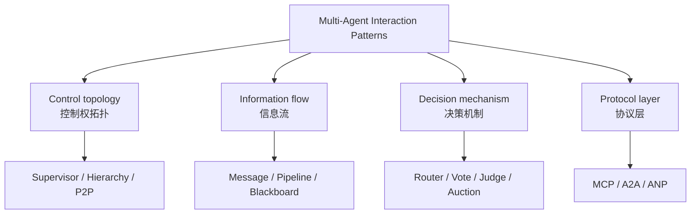

## 3. 模式总览
| # | 模式 | 核心机制 | 适合场景 | 风险 |
|---:|---|---|---|---|
| 1 | Supervisor / Manager / Agents-as-tools | 一个主 agent 保留最终控制权，把其他专业 agent 当作工具调用；子 agent 的中间过程通常不进入用户对话。 | 生产系统、客服分诊、内部 CLI 的工具调用、代码任务中“主 agent + reviewer/tester/searcher”的结构。 | 主 agent 路由错误会导致全局错误；复杂任务中主控可能成为 token 和延迟瓶颈。 |
| 2 | Router / Handoff / Transfer | 当前 agent 根据任务类型把控制权转交给另一个 agent；后续交互由被转交的 agent 接管。 | 多领域客服、企业流程分流、审批/报销/技术支持、需要长期由某个 specialist 维护上下文的场景。 | 容易循环交接；handoff 判定需要约束；跨 agent 的上下文裁剪和权限传递比较关键。 |
| 3 | Sequential Pipeline / Chain | 多个 agent 按固定顺序执行，前一步输出作为后一步输入。 | 结构化流程、文档生成、代码生成流水线、固定审批链、稳定的企业 SOP。 | 上游错误会级联；整体延迟为各步骤之和；对变化适应性弱。 |
| 4 | Parallel Fan-out / Fan-in / Map-Reduce | 同一个任务或拆分后的子任务并行发给多个 agent，再由 aggregator 汇总、投票或合成。 | 多视角评审、并行检索、多模型对比、代码审查、安全/性能/可读性分别检查。 | 聚合器质量很关键；并发状态写入可能冲突；成本可能显著上升。 |
| 5 | Hierarchical Manager-Worker | agent 按层级组织，上级负责规划/分派/审核，下级负责执行；可多层嵌套。 | 大型工程、复杂研究、跨模块任务、需要分阶段验收的企业自动化。 | 层级深导致延迟和 token 膨胀；上级规划错误会系统性扩散。 |
| 6 | Group Chat / Round-robin / Selector Meeting | 多个 agent 共享同一个消息线程或 topic，由规则、LLM selector 或人类决定下一位发言者。 | 头脑风暴、架构评审、专家会诊、需要显式多方对话的场景。 | 容易跑题；消息历史膨胀；speaker 选择策略会影响质量。 |
| 7 | Nested Chat / Inner Loop | 外层 agent 在回复前触发一组内部 agent 对话；内部讨论结果被封装成外层 agent 的一次响应。 | 需要隐藏复杂工具调用、复用内部流程、把多步骤推理包装成单一 agent API。 | 内部链路容易不可见；调试和归因需要额外 trace；成本不容易直觉估计。 |
| 8 | Debate / Critic-Judge / Voting | 多个 agent 提出不同论点或答案，互相批评/反驳，最后由 judge、投票或聚合器给出结论。 | 高不确定推理、方案取舍、事实核查、架构评审、代码 review、模型输出质量提升。 | 多数票不等于正确；judge 偏差会被放大；多轮辩论成本高。 |
| 9 | Role-playing / Virtual Organization | 每个 agent 被赋予明确角色、目标、话语风格和职责边界，通过角色化通信完成任务。 | 软件开发、产品设计、教学模拟、企业流程模拟、复杂任务中的职责拆解。 | 容易形式化对话多、有效产出少；角色设定不等于能力保证。 |
| 10 | Blackboard / Shared Workspace / Event Bus | agent 不一定直接对话，而是读写共享空间；当前共享状态决定下一步哪个 agent 行动。 | 异步研究、长期任务、数据湖检索、多个 agent 贡献局部证据、需要共享状态和复盘的系统。 | 需要强 schema、版本、锁、TTL 和 provenance；否则会变成脏上下文池。 |
| 11 | Market / Auction / Contract Net | 任务或资源通过竞标/报价/协商分配；agent 基于能力、成本、置信度或效用函数提交 bid。 | 资源调度、机器人任务分配、计算/工具预算优化、多 agent 竞争同一任务的最优分配。 | bid 可能不可信；协商开销大；目标函数设计困难。 |
| 12 | Peer-to-peer / Swarm / Decentralized | 没有固定中心控制器，agents 直接互相通信、动态接力或基于环境状态行动。 | 开放环境、自治网络、动态任务分配、中心控制不可用或成本过高的场景。 | 难以收敛；重复劳动；安全与治理复杂；debug 困难。 |
| 13 | Protocol-mediated: A2A / MCP / ANP | 不是单一拓扑，而是让不同框架、供应商、服务或工具生态里的 agent/工具通过标准协议互联。 | 跨团队/跨公司 agent 协作、企业系统集成、工具生态接入、需要标准化发现和通信。 | 安全边界扩大；认证、授权、审计、schema 版本管理成为核心复杂度。 |

## 4. 各模式图解
### 4.1 Supervisor / Manager / Agents-as-tools

**别名**：主控 agent、manager、subagents-as-tools、centralized orchestration

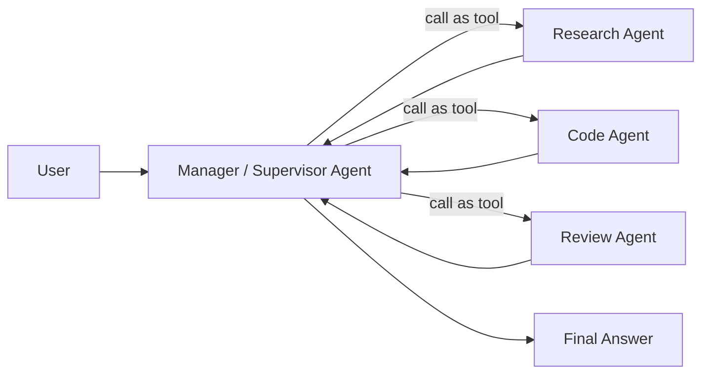

- 核心机制：一个主 agent 保留最终控制权，把其他专业 agent 当作工具调用；子 agent 的中间过程通常不进入用户对话。
- 典型流程：用户请求 -> 主 agent 判断意图和需要的专家 -> 调用一个或多个 specialist -> 主 agent 汇总和最终输出。
- 适合场景：生产系统、客服分诊、内部 CLI 的工具调用、代码任务中“主 agent + reviewer/tester/searcher”的结构。
- 不适合：需要真正自治协商、多个 agent 同权决策、或者不希望中心节点成为瓶颈的场景。
- 优点：控制强、可观测、上下文隔离、容易加权限和审计。
- 风险：主 agent 路由错误会导致全局错误；复杂任务中主控可能成为 token 和延迟瓶颈。
- 参考：S3, S4

### 4.2 Router / Handoff / Transfer

**别名**：路由器、转交、transfer_to_xxx、specialist 接管

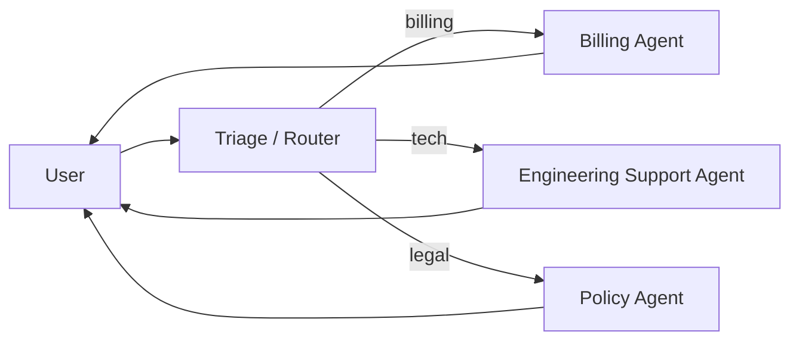

- 核心机制：当前 agent 根据任务类型把控制权转交给另一个 agent；后续交互由被转交的 agent 接管。
- 典型流程：用户请求 -> triage/router 判断领域 -> transfer/handoff -> specialist 继续对话 -> 必要时再交回或转交。
- 适合场景：多领域客服、企业流程分流、审批/报销/技术支持、需要长期由某个 specialist 维护上下文的场景。
- 不适合：任务只需要一次性调用专家工具，或者上下文不应暴露给被转交 agent 的场景。
- 优点：用户体验自然；specialist 可持有自己的上下文和策略；适合长对话。
- 风险：容易循环交接；handoff 判定需要约束；跨 agent 的上下文裁剪和权限传递比较关键。
- 参考：S3

### 4.3 Sequential Pipeline / Chain

**别名**：顺序链、流水线、DAG 的线性特例

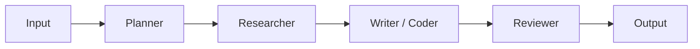

- 核心机制：多个 agent 按固定顺序执行，前一步输出作为后一步输入。
- 典型流程：Plan -> Research -> Draft -> Implement -> Test -> Summarize，每一步有明确输入输出契约。
- 适合场景：结构化流程、文档生成、代码生成流水线、固定审批链、稳定的企业 SOP。
- 不适合：任务高度动态、需要中途重规划或多个 agent 自主协商时。
- 优点：确定性高、调试简单、容易重放和做 checkpoint。
- 风险：上游错误会级联；整体延迟为各步骤之和；对变化适应性弱。
- 参考：S5, S7

### 4.4 Parallel Fan-out / Fan-in / Map-Reduce

**别名**：并行分发-聚合、scatter-gather、concurrent orchestration、map-reduce

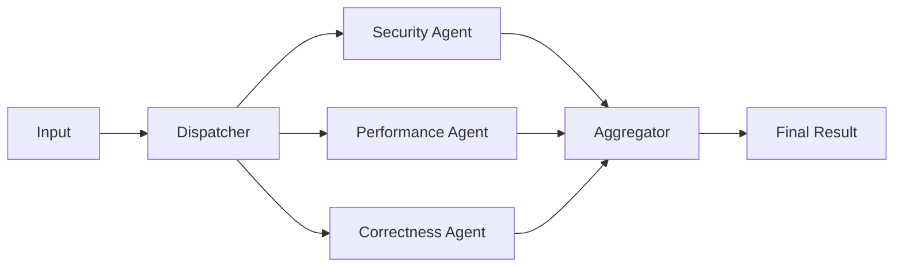

- 核心机制：同一个任务或拆分后的子任务并行发给多个 agent，再由 aggregator 汇总、投票或合成。
- 典型流程：Dispatcher 复制/拆分输入 -> 多个 agents 并行运行 -> Aggregator 收集结果 -> 评分/合并/去重。
- 适合场景：多视角评审、并行检索、多模型对比、代码审查、安全/性能/可读性分别检查。
- 不适合：子任务强依赖顺序，或共享状态容易冲突且没有锁/隔离机制时。
- 优点：降低墙钟时间；天然支持多视角；适合异构模型/工具组合。
- 风险：聚合器质量很关键；并发状态写入可能冲突；成本可能显著上升。
- 参考：S8, S18

### 4.5 Hierarchical Manager-Worker

**别名**：公司式层级、树状组织、多级 manager

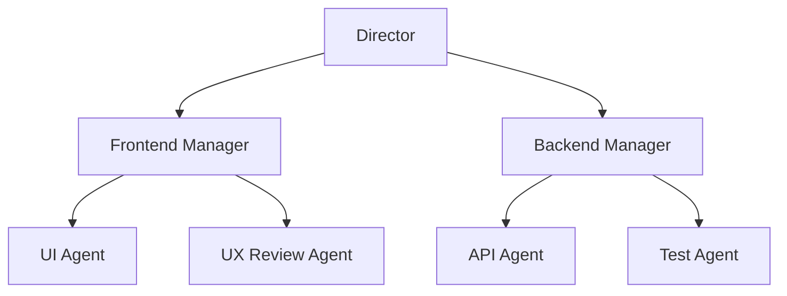

- 核心机制：agent 按层级组织，上级负责规划/分派/审核，下级负责执行；可多层嵌套。
- 典型流程：Director 拆目标 -> Manager 分派任务 -> Worker 执行 -> Manager 验收 -> Director 汇总。
- 适合场景：大型工程、复杂研究、跨模块任务、需要分阶段验收的企业自动化。
- 不适合：任务很小、协作关系不稳定、需要快速自由探索的场景。
- 优点：职责清晰；适合大任务分治；可以逐层加 guardrail。
- 风险：层级深导致延迟和 token 膨胀；上级规划错误会系统性扩散。
- 参考：S5, S1

### 4.6 Group Chat / Round-robin / Selector Meeting

**别名**：群聊、会议室、共同消息线程、speaker selection

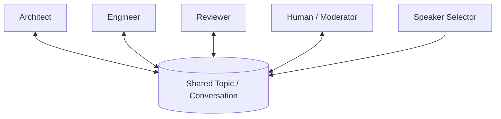

- 核心机制：多个 agent 共享同一个消息线程或 topic，由规则、LLM selector 或人类决定下一位发言者。
- 典型流程：共享主题中持续追加消息 -> selector 选择 speaker -> speaker 发表观点/产物 -> 直到终止条件满足。
- 适合场景：头脑风暴、架构评审、专家会诊、需要显式多方对话的场景。
- 不适合：对延迟/成本敏感、需要强确定性、或者需要严格权限隔离时。
- 优点：多视角透明；容易做人工插入；适合评审和讨论。
- 风险：容易跑题；消息历史膨胀；speaker 选择策略会影响质量。
- 参考：S6, S7

### 4.7 Nested Chat / Inner Loop

**别名**：内嵌对话、内部工作流、agent 的 private sub-dialogue

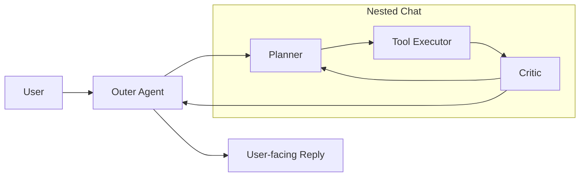

- 核心机制：外层 agent 在回复前触发一组内部 agent 对话；内部讨论结果被封装成外层 agent 的一次响应。
- 典型流程：外层 agent 收到请求 -> 内部 planner/tool-executor/critic 对话 -> 内部结果返回 -> 外层 agent 面向用户输出。
- 适合场景：需要隐藏复杂工具调用、复用内部流程、把多步骤推理包装成单一 agent API。
- 不适合：需要用户看到每个中间步骤或需要严格审计内部决策时。
- 优点：外部接口简单；内部流程可复用；对用户体验友好。
- 风险：内部链路容易不可见；调试和归因需要额外 trace；成本不容易直觉估计。
- 参考：S7

### 4.8 Debate / Critic-Judge / Voting

**别名**：辩论、红队/蓝队、proposer-skeptic-judge、majority vote

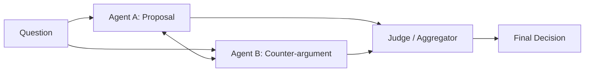

- 核心机制：多个 agent 提出不同论点或答案，互相批评/反驳，最后由 judge、投票或聚合器给出结论。
- 典型流程：多个 candidate agents 生成答案 -> 互相 critique -> 多轮修正 -> judge/vote 选择或合成最终答案。
- 适合场景：高不确定推理、方案取舍、事实核查、架构评审、代码 review、模型输出质量提升。
- 不适合：事实源不充分、judge 不可靠、成本/延迟限制强的在线路径。
- 优点：激发多样性；可以暴露反例和风险；适合验证环节。
- 风险：多数票不等于正确；judge 偏差会被放大；多轮辩论成本高。
- 参考：S9

### 4.9 Role-playing / Virtual Organization

**别名**：角色扮演、虚拟公司、产品/架构/开发/测试角色协同

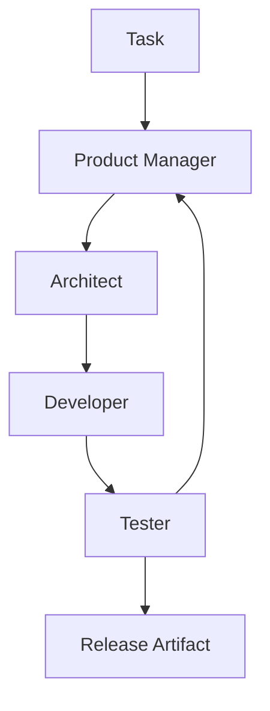

- 核心机制：每个 agent 被赋予明确角色、目标、话语风格和职责边界，通过角色化通信完成任务。
- 典型流程：任务 -> 角色定义 -> 角色间对话/交付物传递 -> 产出设计、代码、测试、文档等。
- 适合场景：软件开发、产品设计、教学模拟、企业流程模拟、复杂任务中的职责拆解。
- 不适合：角色只是表演、没有明确交付物和验收标准的场景。
- 优点：职责清晰；贴近组织协作；方便加入 prompt contract。
- 风险：容易形式化对话多、有效产出少；角色设定不等于能力保证。
- 参考：S10, S11

### 4.10 Blackboard / Shared Workspace / Event Bus

**别名**：黑板、共享记忆、共享工作区、事件总线、发布/订阅

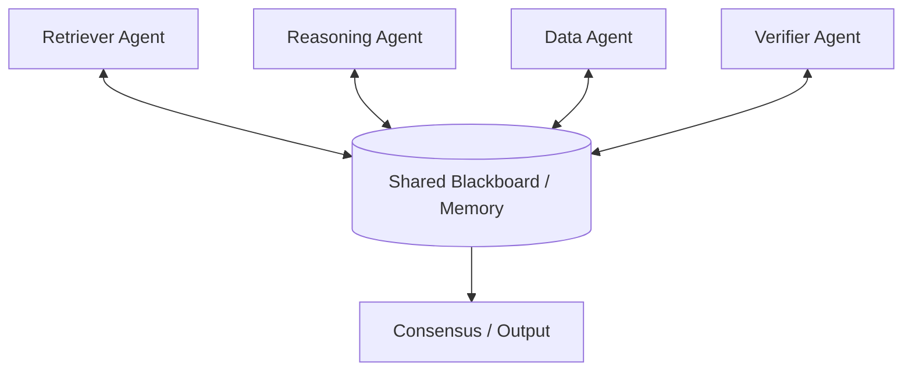

- 核心机制：agent 不一定直接对话，而是读写共享空间；当前共享状态决定下一步哪个 agent 行动。
- 典型流程：问题和中间结果写入 blackboard -> agents 观察状态 -> 有能力的 agent 写入贡献 -> 重复直到收敛。
- 适合场景：异步研究、长期任务、数据湖检索、多个 agent 贡献局部证据、需要共享状态和复盘的系统。
- 不适合：缺少权限/版本控制、共享状态不可控、数据污染难以回滚的场景。
- 优点：天然异步；支持长期积累；每个 agent 可以按能力自主贡献。
- 风险：需要强 schema、版本、锁、TTL 和 provenance；否则会变成脏上下文池。
- 参考：S12

### 4.11 Market / Auction / Contract Net

**别名**：市场机制、拍卖、投标、Contract Net Protocol

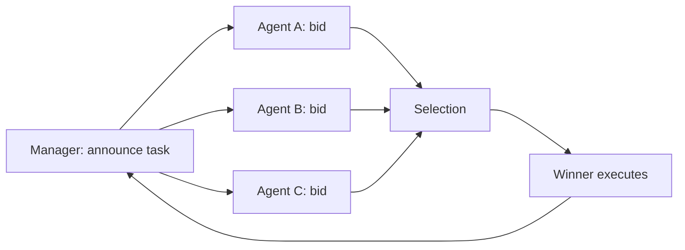

- 核心机制：任务或资源通过竞标/报价/协商分配；agent 基于能力、成本、置信度或效用函数提交 bid。
- 典型流程：Manager 发布任务 -> agents 评估自身能力和成本 -> bid -> manager 选择 winner -> winner 执行并汇报。
- 适合场景：资源调度、机器人任务分配、计算/工具预算优化、多 agent 竞争同一任务的最优分配。
- 不适合：成本函数不清晰、agent 无法可靠评估能力/成本、协商成本高于任务本身。
- 优点：适合资源稀缺和能力异构；可把成本、SLA、置信度纳入分配。
- 风险：bid 可能不可信；协商开销大；目标函数设计困难。
- 参考：S13

### 4.12 Peer-to-peer / Swarm / Decentralized

**别名**：P2P、swarm、flat architecture、去中心化自治网络

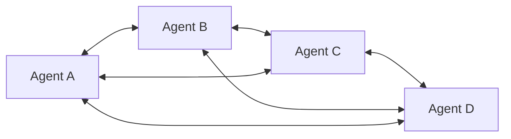

- 核心机制：没有固定中心控制器，agents 直接互相通信、动态接力或基于环境状态行动。
- 典型流程：任意 agent 可发现/调用/转交给其他 agent；拓扑可以动态变化；目标通过局部协议和共享信号推进。
- 适合场景：开放环境、自治网络、动态任务分配、中心控制不可用或成本过高的场景。
- 不适合：需要严格确定性、审计、权限隔离和单一责任人的企业生产路径。
- 优点：扩展性强；对单点故障不敏感；适合动态网络。
- 风险：难以收敛；重复劳动；安全与治理复杂；debug 困难。
- 参考：S1, S2

### 4.13 Protocol-mediated: A2A / MCP / ANP

**别名**：协议层互操作、Agent Card、JSON-RPC tools/resources、去中心化身份/发现

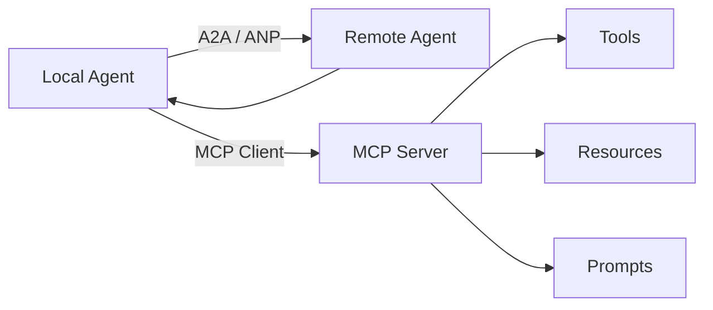

- 核心机制：不是单一拓扑，而是让不同框架、供应商、服务或工具生态里的 agent/工具通过标准协议互联。
- 典型流程：Agent 通过 A2A/ANP 发现并调用远端 agent；通过 MCP 访问外部 tools/resources/prompts。
- 适合场景：跨团队/跨公司 agent 协作、企业系统集成、工具生态接入、需要标准化发现和通信。
- 不适合：单机闭环、强内聚内部系统、协议治理和安全能力不足时。
- 优点：互操作性强；降低供应商/框架锁定；便于外部能力市场化。
- 风险：安全边界扩大；认证、授权、审计、schema 版本管理成为核心复杂度。
- 参考：S14, S15, S16, S17

## 5. 内部 CLI / Agent 平台推荐路线
- **Phase 1：可控主链路**：Supervisor + tools/subagents + sequential task plan。完成工具注册、权限、日志、trace、预算控制、可重放执行。
- **Phase 2：并行质量层**：Fan-out reviewer + critic/judge。把安全、性能、正确性、规范检查拆成并行 reviewer，聚合后给主 agent。
- **Phase 3：长任务与状态**：Task store + blackboard + worktree/sandbox isolation。适合多轮开发、后台任务、代码改动隔离和 session 恢复。
- **Phase 4：跨系统互联**：MCP for tools/resources, A2A/ANP for agent-agent。标准化能力发现、外部 agent 调用、权限和审计。

## 6. 参考资料
- [S1] Multi-Agent Collaboration Mechanisms: A Survey of LLMs - arXiv, 2025：https://arxiv.org/html/2501.06322v1  
  提出 actor / collaboration type / structure / strategy / coordination protocol 等协作维度。
- [S2] A Communication-Centric Survey of LLM-Based Multi-Agent Systems - arXiv, 2025：https://arxiv.org/html/2502.14321v2  
  从通信结构角度讨论 flat / hierarchical 等架构。
- [S3] OpenAI Agents SDK - Orchestration and handoffs - OpenAI Developers：https://developers.openai.com/api/docs/guides/agents/orchestration  
  说明 agents-as-tools 与 handoffs 两种核心编排方式。
- [S4] LangChain Multi-agent / Subagents - LangChain Docs：https://docs.langchain.com/oss/python/langchain/multi-agent/subagents  
  定义 supervisor 调用 subagents as tools 的中心化模式。
- [S5] CrewAI Processes - CrewAI Docs：https://docs.crewai.com/en/concepts/processes  
  区分 sequential 与 hierarchical process。
- [S6] AutoGen Conversation Patterns / Group Chat - Microsoft AutoGen Docs：https://microsoft.github.io/autogen/stable/user-guide/core-user-guide/design-patterns/group-chat.html  
  group chat 中 agents 共享同一消息主题，发布/订阅同一 thread。
- [S7] AutoGen Conversation Patterns - Microsoft AutoGen 0.2 Docs：https://microsoft.github.io/autogen/0.2/docs/tutorial/conversation-patterns/  
  包含 two-agent、sequential、group chat、nested chat 等会话模式。
- [S8] AI Agent Orchestration Patterns - Azure Architecture Center - Microsoft Azure Architecture Center, 2026：https://learn.microsoft.com/en-us/azure/architecture/ai-ml/guide/ai-agent-design-patterns  
  把 concurrent orchestration 等同于 fan-out/fan-in、scatter-gather、map-reduce。
- [S9] Encouraging Divergent Thinking in Large Language Models through Multi-Agent Debate - EMNLP 2024 / ACL Anthology：https://aclanthology.org/2024.emnlp-main.992/  
  提出 Multi-Agent Debate, 多个 agent 论辩，judge 管理辩论并输出最终解。
- [S10] CAMEL: Communicative Agents for Mind Exploration of Large Language Model Society - arXiv / NeurIPS 2023：https://arxiv.org/abs/2303.17760  
  提出 role-playing communicative agents 与 inception prompting。
- [S11] ChatDev: Communicative Agents for Software Development - arXiv / ACL 2024：https://arxiv.org/abs/2307.07924  
  以设计、编码、测试等 specialized agents 通过 chat chain 协同完成软件开发。
- [S12] Exploring Advanced LLM Multi-Agent Systems Based on Blackboard Architecture - arXiv, 2025：https://arxiv.org/abs/2507.01701  
  把 blackboard 架构引入 LLM MAS，使不同角色共享信息与消息，并按黑板状态选择行动者。
- [S13] The Contract Net Protocol: High-Level Communication and Control in a Distributed Problem Solver - IEEE Transactions on Computers, 1980：https://dl.acm.org/doi/10.1109/TC.1980.1675516  
  经典任务分配/协商协议，节点通过 negotiation 分配任务。
- [S14] Model Context Protocol Specification - MCP Official Spec, 2025-11-25：https://modelcontextprotocol.io/specification/2025-11-25  
  MCP server 提供 resources、prompts、tools；基础协议使用 JSON-RPC 消息类型。
- [S15] Agent2Agent Protocol Documentation - A2A Official Docs / Linux Foundation project：https://a2a-protocol.org/latest/  
  开放标准，面向不同框架/供应商 agent 之间的安全通信和协作。
- [S16] Announcing the Agent2Agent Protocol - Google Developers Blog, 2025-04-09：https://developers.googleblog.com/en/a2a-a-new-era-of-agent-interoperability/  
  A2A 用于 agents 安全交换信息并协调企业平台/应用上的动作。
- [S17] Agent Network Protocol - ANP Official Site：https://agent-network-protocol.com/  
  开放源代码的去中心化 agent 通信协议，包含 identity、discovery、messaging 等。
- [S18] Multiagent sessions - Claude API Docs, 2026 beta：https://platform.claude.com/docs/en/managed-agents/multi-agent  
  描述一个 agent 协调其他 agent；agents 可在隔离上下文中并行执行。