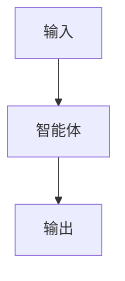

# 模式名称

## 定义

一两句话。该模式是什么，以及它与相邻模式的区别。

## 结构



## 适用场景

- 场景 1
- 场景 2
- 场景 3

## 不适用场景

- 反场景 1
- 反场景 2

## 实现方法

1. 定义输入/输出模式。
2. 定义智能体角色和工具边界。
3. 定义状态、超时、重试、取消。
4. 定义追踪事件。
5. 定义失败时的降级策略。

## 最小伪代码

```ts
async function runPattern(input: Input): Promise<Output> {
  // TODO
}
```

## 推荐追踪事件

- `pattern.started`
- `pattern.completed`
- `pattern.failed`

## 常见失败模式

- 失败模式 1
- 失败模式 2

## 实现检查清单

- [ ] 输入/输出模式已定义
- [ ] 权限边界已定义
- [ ] 追踪事件已定义
- [ ] 失败策略已定义
- [ ] 成本和超时已定义

## 参考资料

- 链接 1
