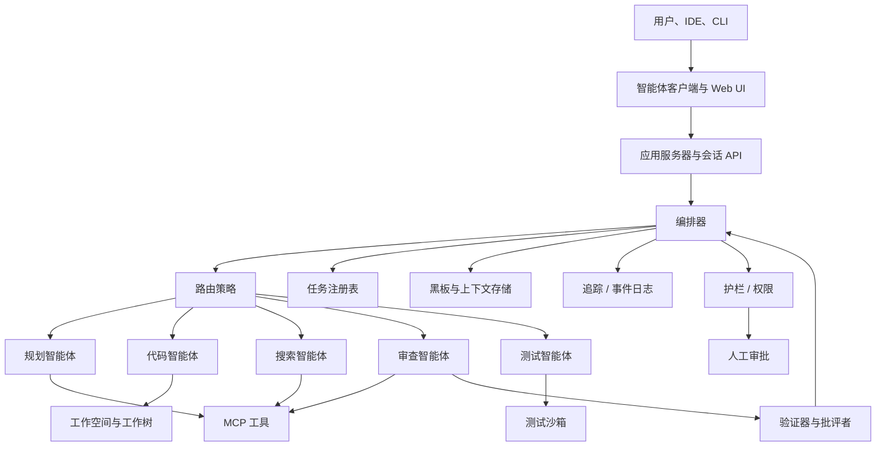

# 生产级多智能体运行时

此架构适用于内部编码智能体平台、智能体 CLI、IDE 智能体后端，或 Claude Code / Codex 风格系统背后的编排层。



## 核心模块

| 模块 | 职责 | 需交付的能力 |
|---|---|---|
| 应用服务器与会话 API | 接收来自用户、IDE、CLI 的请求 | 会话、流式传输、取消、恢复 |
| 编排器 | 调度智能体和工作流 | 规划、路由、重试、超时、检查点 |
| 智能体注册表 | 管理智能体定义 | 名称、角色、模型、工具、权限、提示词 |
| 任务注册表 | 管理任务树 | 任务 ID、父 ID、状态、所有者、工件 |
| 黑板与上下文存储 | 保存共享事实和工件 | 事实、工件、决策、TTL、来源 |
| 事件日志与追踪 | 记录每个动作 | 消息、工具调用、交接、状态变更 |
| 护栏 | 权限和安全 | 策略、风险评分、审批、沙箱 |
| 工作空间管理器 | 隔离执行 | 工作树、容器、快照、回滚 |
| 协议网关 | 向其他系统暴露接口 | MCP、A2A、智能体客户端协议 |

## 推荐数据模型

```ts
export type AgentDefinition = {
  id: string;
  name: string;
  role: string;
  model: string;
  instructions: string;
  tools: string[];
  permissions: Permission[];
  memoryScope: "none" | "session" | "project" | "global";
};

export type Task = {
  id: string;
  parentId?: string;
  sessionId: string;
  assignedAgent?: string;
  goal: string;
  status: "pending" | "running" | "blocked" | "done" | "failed" | "cancelled";
  input: unknown;
  output?: unknown;
  artifacts?: Artifact[];
  createdAt: string;
  updatedAt: string;
};

export type TraceEvent = {
  id: string;
  runId: string;
  sessionId: string;
  taskId?: string;
  actor: string;
  type: string;
  payload: unknown;
  timestamp: string;
};
```

## 最小运行循环

```ts
async function runSession(session: Session) {
  let state = await loadCheckpoint(session.id);

  while (!state.done) {
    const next = await orchestrator.next(state);

    await eventBus.publish({
      type: "workflow.node.enter",
      actor: "orchestrator",
      payload: next,
    });

    const result = await runNode(next, state);
    state = await checkpoint(reduce(state, result));
  }

  return state.finalAnswer;
}
```

## 关键原则

1. **智能体是可替换的执行单元，不是全局状态容器。**
2. **编排器拥有流程；智能体拥有专业输出。**
3. **黑板存储事实和工件；追踪存储过程。**
4. **所有高风险操作都经过护栏。**
5. **每个智能体的上下文应最小化、隔离、可审计。**
