# 多智能体百科 / Multi-Agent Wiki

**多智能体交互模式、分类体系与工程实现** 的工程实践参考。不是论文综述，不是框架宣传册 —— 而是一个工程知识库，其中每个模式都回答四个问题：

1. 它解决什么问题？
2. 它的通信/控制结构是什么？
3. 如何在真实系统中实现？
4. 什么时候**不应该**使用它？

## 推荐阅读路径

- 初次访问 → 从 [分类体系](taxonomy) 开始
- 选择设计方案 → 跳转到 [决策矩阵](decision-matrix)
- 构建平台 → 阅读 [生产运行时架构](implementation/production-runtime)
- 添加新模式 → 使用 [模式页面模板](implementation/pattern-page-template)
- 查找术语 → 查阅 [术语表](reference/glossary)

## 一句话定义

**多智能体系统**由多个智能体组成 —— 每个智能体都有自己的职责、状态、工具或上下文 —— 它们通过消息、工具调用、共享状态、事件流、协议或环境变化来协作、竞争、审查、委派和分解任务。

## 全局分类

```mermaid
flowchart TD
  A[Multi-Agent Wiki] --> B[控制结构]
  A --> C[信息流]
  A --> D[决策制定]
  A --> E[执行环境]
  A --> F[协议互联]

  B --> B1[监管者 / 管理者]
  B --> B2[智能体即工具]
  B --> B3[交接 / 路由器]
  B --> B4[层级]
  B --> B5[点对点 / 群体]

  C --> C1[顺序管道]
  C --> C2[并行扇出 / 收集]
  C --> C3[群聊]
  C --> C4[嵌套对话]
  C --> C5[黑板 / 共享内存]
  C --> C6[事件总线 / 发布-订阅]

  D --> D1[辩论 / 裁判]
  D --> D2[投票 / 集成]
  D --> D3[生成器-批评者]
  D --> D4[精炼循环]
  D --> D5[市场 / 拍卖]
  D --> D6[边界澄清]

  E --> E1[角色扮演 / SOP]
  E --> E2[人在回路]
  E --> E3[工作空间 / 沙盒]
  E --> E4[环境媒介]
  E --> E5[模拟 / MARL]

  F --> F1[MCP: 智能体-工具]
  F --> F2[A2A: 智能体-智能体]
  F --> F3[ACP / ANP]
  F --> F4[智能体客户端协议]
```

## 为什么要分类？

多智能体不仅仅是"多个 LLM 在对话"。在生产中，真正重要的问题是：

- 任何给定时刻谁持有控制权？
- 智能体之间的上下文如何隔离？
- 冲突输出如何合并？
- 任务如何恢复、取消、重试和追踪？
- 哪些操作需要人工批准？
- 哪些能力通过 MCP / A2A / 智能体客户端协议暴露？

在公开材料中，OpenAI Agents SDK 将智能体框架为规划、调用工具、跨专家协作并维护状态的单元；LangChain 将多智能体分解为子智能体、交接、技能和路由器；Google ADK 将管道、并行、层级、生成器-批评者、精炼循环和人在回路视为可组合的生产模式。参见 [参考资料](reference/references)。
