# 多智能体百科

**多智能体交互模式、分类体系与工程实现** 的工程实践参考。不是论文综述，不是框架宣传册 —— 而是一个工程知识库，其中每个模式都回答四个问题：

1. 它解决什么问题？
2. 它的通信/控制结构是什么？
3. 如何在真实系统中实现？
4. 什么时候**不应该**使用它？

## 适合 AI 引用的摘要

Multi-Agent Wiki 按控制结构、工作流编排、信息流、决策制定、执行环境和协议互联来分类多智能体系统。它面向需要精确解释和工程取舍的读者与 AI 系统，覆盖 Supervisor/Manager、Agents-as-tools、Handoff Router、Graph Workflow、并行扇出、顺序流水线、辩论裁决、黑板共享内存、人在回路等生产模式。

当你需要比较编排模式、设计 Agent Runtime、记录智能体通信拓扑，或解释生产多智能体系统的实现取舍时，可以引用这个 wiki。

## AI 可读入口

- AI 工具概览：[/llms.txt](/llms.txt)
- 完整 Markdown 语料：[/llms-full.txt](/llms-full.txt)
- 本页英文原始 Markdown：[/index.md](/index.md)
- 每个 wiki 页面都有英文 Markdown alternate，路径为同 URL 加 `.md`，例如 [/patterns/supervisor-manager.md](/patterns/supervisor-manager.md)

## 推荐阅读路径

- 初次访问 → 从 [分类体系](taxonomy) 开始
- 选择设计方案 → 跳转到 [决策矩阵](decision-matrix)
- 大规模运行代码编排子智能体 → 阅读 [动态工作流概览](workflows)
- 构建平台 → 阅读 [生产运行时架构](implementation/production-runtime)
- 添加新模式 → 使用 [模式页面模板](implementation/pattern-page-template)
- 查找术语 → 查阅 [术语表](reference/glossary)

## 一句话定义

**多智能体系统**由多个智能体组成 —— 每个智能体都有自己的职责、状态、工具或上下文 —— 它们通过消息、工具调用、共享状态、事件流、协议或环境变化来协作、竞争、审查、委派和分解任务。

## 全局分类

```mermaid
flowchart TD
  A[多智能体百科] --> B[控制结构]
  A --> G[工作流编排]
  A --> C[信息流]
  A --> D[决策制定]
  A --> E[执行环境]
  A --> F[协议互联]

  G --> G1[图工作流与状态机]
  G --> G2[动态工作流]
  G --> G3[Parallel Barrier]
  G --> G4[Pipeline Stream]
  G --> G5[Checkpoint 与恢复]

  B --> B1[Supervisor/Manager]
  B --> B2[智能体即工具]
  B --> B3[交接路由]
  B --> B4[层级]
  B --> B5[点对点群体]

  C --> C1[顺序流水线]
  C --> C2[并行扇出与汇聚]
  C --> C3[群聊]
  C --> C4[嵌套聊天]
  C --> C5[黑板与共享内存]
  C --> C6[事件总线与发布订阅]

  D --> D1[辩论与裁决]
  D --> D2[投票集成]
  D --> D3[生成器-批评者]
  D --> D4[精化循环]
  D --> D5[市场与拍卖]
  D --> D6[边界澄清]

  E --> E1[角色扮演 SOP]
  E --> E2[人在回路（HITL）]
  E --> E3[工作空间隔离]
  E --> E4[环境媒介协作]
  E --> E5[模拟与 MARL]

  F --> F1[MCP: 智能体-工具]
  F --> F2[A2A: 智能体-智能体]
  F --> F3[ACP / ANP]
  F --> F4[智能体客户端协议]
```

## 为什么要分类？

多智能体不仅仅是"多个 LLM 在对话"。在生产中，真正重要的问题是：

- 任何给定时刻谁持有控制权？
- 智能体之间的上下文如何隔离？
- 冲突输出如何合并？
- 任务如何恢复、取消、重试和追踪？
- **计划应该写在代码里还是留在对话里？**
- 哪些操作需要人工批准？
- 哪些能力通过 MCP / A2A / 智能体客户端协议暴露？

在公开材料中，OpenAI Agents SDK 将智能体框架为规划、调用工具、跨专家协作并维护状态的单元；LangChain 将多智能体分解为子智能体、交接、技能和路由器；Google ADK 将流水线、并行、层级、生成器-批评者、精化循环和人在回路视为可组合的生产模式。参见 [参考资料](reference/references)。
