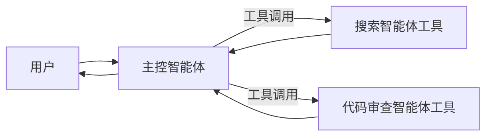

# 智能体即工具

## 定义

将专业智能体封装为可调用的工具。主控智能体永远不会放弃控制权——它只是像调用普通函数一样调用专业智能体。

**类别**：控制结构

## 结构



## 适用场景

单次专业查询、检索子任务、代码审查、文档摘要、将内部能力以工具形式对外暴露。

## 不适用场景

当专业智能体需要与用户进行持续多轮对话时，或当智能体之间需要相互接管控制权时。

## 实现方法

1. 将每个子智能体封装为普通工具，例如 `callSearchAgent(input)`。
2. 工具的模式（schema）必须严格限定输入和输出——不要留下自然语言接口。
3. 主控智能体的系统提示中声明何时调用每个智能体工具。
4. 子智能体从不直接面对用户；它们返回结果、证据和限制信息。
5. 每个智能体工具拥有独立的追踪记录，以便故障归因。

## 最小伪代码

```ts
const searchAgentTool = tool({
  name: "search_agent",
  description: "调查公开来源并返回证据列表",
  schema: z.object({ query: z.string(), depth: z.enum(["fast", "deep"]) }),
  execute: async ({ query, depth }) => searchAgent.run({ query, depth })
});

const mainAgent = new Agent({
  tools: [searchAgentTool, reviewAgentTool],
  instructions: "需要研究时调用 search_agent；需要质量检查时调用 review_agent。"
});
```

## 推荐的追踪事件

- `tool.agent.invoked`
- `tool.agent.output`
- `tool.agent.error`

## 常见失败模式

- 子智能体工具描述过于宽泛；主控智能体不加区分地调用它。
- 子智能体返回冗长散文而非结构化结果。
- 主控智能体未经验证就将子智能体视为权威。

## 实现检查清单

- [ ] 输入/输出模式已定义。
- [ ] 每个智能体的权限边界已定义。
- [ ] 每次智能体调用都携带运行标识 / 追踪标识。
- [ ] 失败、超时、取消和重试策略已定义。
- [ ] 传递的上下文是最小必需的，而非完整历史。
- [ ] 高风险操作由审批或验证器把关。

## 参考

- [OpenAI tools](https://openai.github.io/openai-agents-python/tools/)
- [LangChain multi-agent](https://docs.langchain.com/oss/python/langchain/multi-agent)
