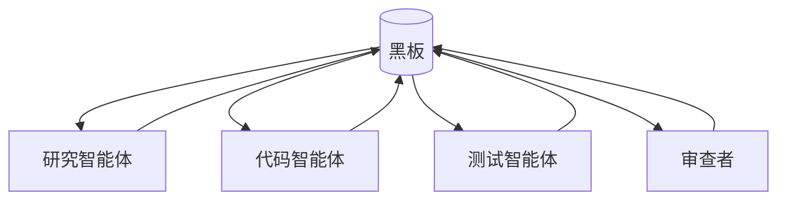

# 黑板与共享内存

## 定义

多个智能体通过共享状态、知识库、任务板或工作空间进行间接协作。

**类别**：信息流

## 结构



## 适用场景

长时间运行任务、异步协作、多方共享证据、代码工作空间、任务状态管理。

## 不适用场景

当共享状态没有版本控制、没有权限管理、没有过期机制时——它会腐烂。

## 实现方法

1. 将黑板分区：`事实 / 假设 / 任务 / 产物 / 决策`。
2. 每条记录都携带来源、时间戳、置信度、所有者和生存时间（TTL）。
3. 智能体只能通过 API 读写——禁止直接全局状态变更。
4. 将冲突事实作为冲突集暴露出来；不要静默覆盖。

## 最小伪代码

```ts
type BlackboardItem = {
  id: string;
  type: "fact" | "hypothesis" | "artifact" | "decision" | "task";
  content: unknown;
  sourceAgent: string;
  confidence?: number;
  createdAt: string;
  ttl?: number;
};
```

## 推荐的追踪事件

- `blackboard.item.created`
- `blackboard.item.updated`
- `blackboard.conflict.detected`
- `blackboard.item.expired`

## 常见失败模式

- 状态污染。
- 陈旧条目被当作新鲜条目使用。
- 多个智能体并发写入。
- 缺乏来源追溯。

## 实现检查清单

- [ ] 输入/输出模式已定义。
- [ ] 每个智能体的权限边界已定义。
- [ ] 每次智能体调用都携带运行标识 / 追踪标识。
- [ ] 失败、超时、取消和重试策略已定义。
- [ ] 传递的上下文是最小必需的，而非完整历史。
- [ ] 高风险操作由审批或验证器把关。

## 参考

- [Survey of communication](https://arxiv.org/html/2502.14321v2)
- [Google ADK patterns](https://developers.googleblog.com/developers-guide-to-multi-agent-patterns-in-adk/)
