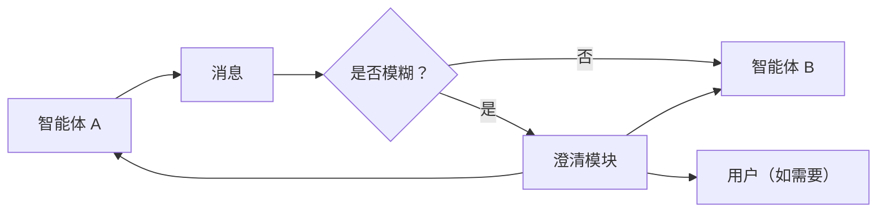

# 边缘澄清 / 先问后行

## 定义

在智能体间交接边界或不确定操作之前插入澄清步骤，以减少错误传播。

**类别**：决策

## 适用场景

模糊的需求、智能体交接、长任务、多约束任务、用户意图不明确。

## 不适用场景

当每一步都询问用户不可接受时，或当澄清无法改变执行结果时。

## 结构



## 实现方法

1. 对每条跨智能体消息进行模糊度/风险评分。
2. 超过阈值时，向源智能体或用户询问——不要猜测。
3. 澄清问题应简洁、具体、可执行。
4. 记录澄清是否确实减少了失败，并据此调整阈值。

## 最小伪代码

```ts
const score = ambiguityScorer.score(edgeMessage);
if (score > threshold) {
  const clarification = await askClarification(edgeMessage);
  edgeMessage = merge(edgeMessage, clarification);
}
return targetAgent.run(edgeMessage);
```

## 推荐的追踪事件

- `clarification.triggered`
- `clarification.question.asked`
- `clarification.answer.received`
- `clarification.skipped`

## 常见失败模式

- 过度打断用户。
- 问题过于抽象，用户无法回答。
- 澄清结果未能回写至状态。

## 实现检查清单

- [ ] 输入/输出模式已定义。
- [ ] 每个智能体的权限边界已定义。
- [ ] 每次智能体调用都携带运行标识 / 追踪标识。
- [ ] 失败、超时、取消和重试策略已定义。
- [ ] 传递的上下文是最小必需的，而非完整历史。
- [ ] 高风险操作由审批或验证器把关。

## 参考

- [AgentAsk](https://arxiv.org/html/2510.07593v1)
