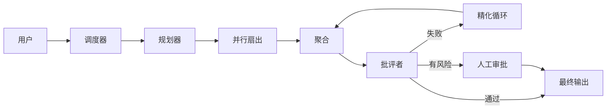

# 复合模式

## 定义

真实的生产系统很少是单一模式。它们将流水线、并行、交接、批评者、人机协同、黑板和协议层组合成一个业务流程。

**类别**：组合

## 结构



## 适用场景

企业级智能体平台、编码智能体、支持智能体、研究智能体——任何需要稳定交付的场景。

## 不适用场景

在单一模式被验证之前。组合复杂度会快速叠加。

## 实现方法

1. 首先确定主流程：工作流 / 图。
2. 在特定节点插入模式：并行检索、交接、批评者、审批。
3. 所有模式共享一个状态模型、事件模型和任务注册表。
4. 在每个组合边界定义输入/输出模式。
5. 先交付 P0 路径；迭代式添加高级模式。

## 最小伪代码

```ts
const workflow = graph()
  .node("plan", planner)
  .node("parallel_research", fanout([searchA, searchB]))
  .node("draft", writer)
  .node("review", critic)
  .edge("review", s => s.review.pass ? "final" : "draft");

return workflow.run(userTask);
```

## 推荐的追踪事件

- `composite.workflow.started`
- `composite.pattern.enter`
- `composite.pattern.exit`
- `composite.workflow.completed`

## 常见失败模式

- 组合后无法判断是哪个模式导致了问题。
- 状态模型不一致。
- 每个模式有自己的追踪记录；没有任何东西将它们关联起来。

## 实现检查清单

- [ ] 触发和退出条件已定义。
- [ ] 输入/输出模式已定义。
- [ ] 权限、预算、超时和重试策略已定义。
- [ ] 追踪事件已定义。
- [ ] 降级或人工接管策略已定义。

## 参考

- [Google ADK patterns](https://developers.googleblog.com/developers-guide-to-multi-agent-patterns-in-adk/)
- [Microsoft Agent Framework](https://learn.microsoft.com/en-us/agent-framework/overview/)
