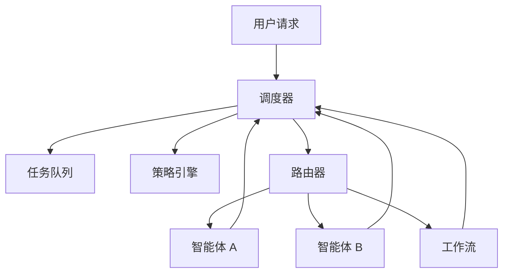

# 协调器 / 调度器

## 定义

调度器将请求分发给智能体、工作流或工具，并维护任务状态、重试、超时和路由策略。它比路由器更注重工程实现，比监督者更偏向系统组件。

**类别**：控制结构

## 结构



## 适用场景

内部平台、长时间运行任务、多租户智能体服务、需要可恢复调度和统一策略的系统。

## 不适用场景

一次性演示、单智能体对话、或无状态恢复需求的轻量级任务。

## 实现方法

1. 将调度器设计为服务层——而非大语言模型智能体。
2. 对每个请求，创建任务 / 运行 / 会话并写入检查点。
3. 根据策略选择同步执行、异步队列、工作流或交接。
4. 将智能体结果归约为统一状态：`成功 / 阻塞 / 需输入 / 失败`。
5. 在调度器集中管理重试、取消、超时和预算。

## 最小伪代码

```ts
type DispatchDecision = {
  mode: "agent" | "workflow" | "tool" | "ask_user";
  target: string;
  async: boolean;
  reason: string;
};

async function dispatch(req: UserRequest) {
  const run = await runs.create(req);
  const decision = await router.decide(req, policy.allowedTargets(req));
  return scheduler.schedule(run, decision);
}
```

## 推荐的追踪事件

- `dispatch.request.created`
- `dispatch.decision.made`
- `dispatch.scheduled`
- `dispatch.completed`

## 常见失败模式

- 调度器开始编写复杂提示——它变成了一个不透明的智能体。
- 缺乏任务/运行/会话分层。
- 重试策略分散在每个智能体内部。

## 实现检查清单

- [ ] 触发和退出条件已定义。
- [ ] 输入/输出模式已定义。
- [ ] 权限、预算、超时和重试策略已定义。
- [ ] 追踪事件已定义。
- [ ] 降级或人工接管策略已定义。

## 参考

- [Google ADK patterns](https://developers.googleblog.com/developers-guide-to-multi-agent-patterns-in-adk/)
