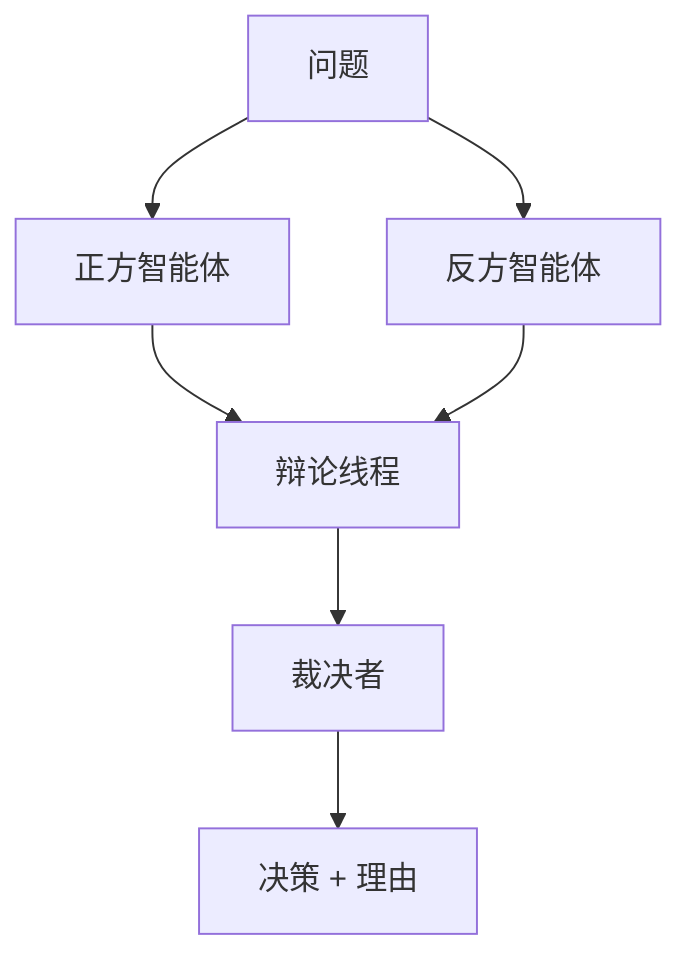

# 辩论 / 裁决 / 投票

## 定义

多个智能体提出不同立场或答案并相互挑战；由裁决者或投票机制选出最终结果。

**类别**：决策

## 结构



## 适用场景

选项选择、红队/蓝队、事实核查、复杂推理、在多个候选答案中进行选择。

## 不适用场景

当答案可以通过工具验证时、当成本至关重要时、或当裁决者本身不可靠时。

## 实现方法

1. 让智能体独立生成初始立场，以减少交叉污染。
2. 限制辩论轮数，避免无休止的争论。
3. 裁决者必须引用证据和评分标准——而非仅凭偏好。
4. 对于可验证任务，优先使用工具验证而非大语言模型裁决。

## 最小伪代码

```ts
const proposals = await Promise.all(agents.map(a => a.propose(question)));
const debate = await runDebate(proposals, { rounds: 2 });
const verdict = await judge.evaluate({ question, proposals, debate, rubric });
return verdict;
```

## 推荐的追踪事件

- `debate.proposal.created`
- `debate.round.completed`
- `judge.verdict.created`
- `vote.tallied`

## 常见失败模式

- 有说服力但事实错误的论点获胜。
- 裁决者偏爱更雄辩的智能体。
- 成本超过决策本身的价值。

## 实现检查清单

- [ ] 输入/输出模式已定义。
- [ ] 每个智能体的权限边界已定义。
- [ ] 每次智能体调用都携带运行标识 / 追踪标识。
- [ ] 失败、超时、取消和重试策略已定义。
- [ ] 传递的上下文是最小必需的，而非完整历史。
- [ ] 高风险操作由审批或验证器把关。

## 参考

- [Survey: LLM-based multi-agent](https://arxiv.org/html/2412.17481v2)
