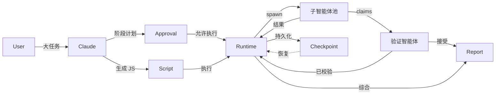

## 它解决的问题

当任务超出单轮对话或少数子智能体的稳定能力范围时，编排逻辑应固化在代码里，而不是依赖每一轮的临场判断。

对话式智能体在主上下文里协调一切时会遇到三个相互叠加的问题：

- **上下文稀释**：几十个文件或来源的中间结果挤占主上下文，淹没综合理解。
- **计划漂移**：没有持久化的计划表示，每一轮都从头推导协调方式。
- **缺乏恢复边界**：会话中断后没有任何中间状态留存。

动态工作流把计划搬进可执行脚本：脚本持有循环、分支、扇出、中间变量、交叉验证逻辑和收敛条件；真正的读写、命令、Web、MCP 工作由子智能体完成。

## 拓扑

## 控制语义

工作流脚本拥有控制流：Claude 一次性把完整计划（阶段、迭代条件、扇出形状、停止条件）写成脚本；runtime 在后台执行；脚本调用子智能体池做实际工作；脚本决定何时验证、何时 checkpoint、何时收敛。**计划是一等产物**，而非每轮对话推理的副产物。

## 状态语义

中间结果存在脚本变量和 runtime 状态中，不进入主对话上下文。最终只有综合后的报告回到用户会话。这意味着 50 个文件的审计结果不必同时塞进同一个上下文窗口；部分结果可以 checkpoint 并被复用；主会话在工作流后台运行期间保持响应。

## 适用场景

- 全代码库审计、大规模迁移、交叉验证的研究、方案压力测试，以及需要保存复跑的工程流程。

## 不适用场景

- 单智能体一次就能搞定的小任务；需要中途人工签字的高交互任务；未做预算和权限审查就直接跑全库的工作流。

## 风险

Token 和 rate-limit 成本会快速放大；拆解差会引起相关性失败；运行长任务前必须设计权限、allowlist、trace、checkpoint 与 rollback。

## 相关模式

- [图工作流](/patterns/graph-workflow) — 设计时固化的状态机；动态工作流则是模型生成的脚本。
- [并行扇出 / 收集](/patterns/parallel-fanout-gather) — 单层扇出，没有脚本持有计划。
- [生成器-批评者](/patterns/generator-critic) — 动态工作流把对抗式审查推广到脚本驱动。
- [精炼循环](/patterns/refinement-loop) — 动态工作流把循环放进脚本而非主上下文。
- [工作空间隔离](/patterns/workspace-isolation) — worktree 提供文件级隔离，使并行写入安全。

完整工程细节参见英文版页面。
