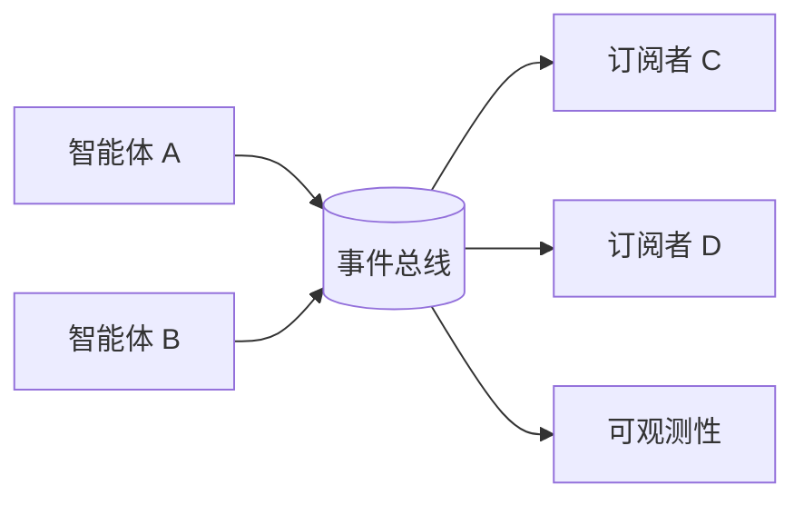

# 事件总线与发布订阅

## 定义

智能体通过事件、主题和队列进行异步通信，而非通过直接函数调用。

**类别**：信息流

## 结构



## 适用场景

平台级异步任务、长时间运行工作、可观测性、跨服务智能体编排。

## 不适用场景

简单同步任务，或缺乏事件模式治理的组织。

## 实现方法

1. 设计统一的事件信封：`event_id, run_id, session_id, type, payload, timestamp`。
2. 每种事件类型定义模式和版本。
3. 每个智能体操作都发布事件；编排器从日志中恢复状态。
4. 支持重放、去重、幂等性、死信队列。

## 最小伪代码

```ts
type AgentEvent = {
  id: string;
  runId: string;
  sessionId: string;
  type: string;
  actor: string;
  payload: unknown;
  ts: string;
  schemaVersion: string;
};
```

## 推荐的追踪事件

- `event.published`
- `event.consumed`
- `event.replayed`
- `event.dead_lettered`

## 常见失败模式

- 没有模式的事件。
- 重复消费导致重复副作用。
- 异步管道难以调试。
- 事件量过高且未采样。

## 实现检查清单

- [ ] 输入/输出模式已定义。
- [ ] 每个智能体的权限边界已定义。
- [ ] 每次智能体调用都携带运行标识 / 追踪标识。
- [ ] 失败、超时、取消和重试策略已定义。
- [ ] 传递的上下文是最小必需的，而非完整历史。
- [ ] 高风险操作由审批或验证器把关。

## 参考

- [Microsoft Agent Framework](https://learn.microsoft.com/en-us/agent-framework/overview/)
- [Survey of communication](https://arxiv.org/html/2502.14321v2)
