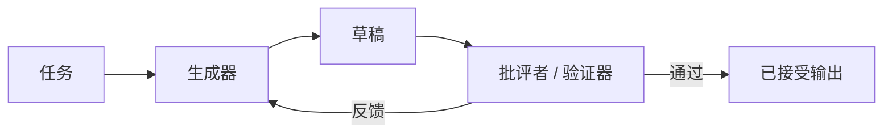

# 生成器-批评者 / 验证器

## 定义

一个智能体生成内容；另一个进行批评、验证、评分或提出修订建议。

**类别**：决策

## 结构



## 适用场景

代码生成 + 审查、文档起草 + 编辑、计划生成 + 验证、测试修复循环。

## 不适用场景

当批评者没有额外信息或工具时——它只会重复生成器的偏见。

## 实现方法

1. 批评者的提示和工具必须与生成者不同。
2. 批评者的输出应结构化：问题、严重程度、证据、建议修复。
3. 对于代码任务，批评者应尽可能运行测试、代码检查工具和差异检查。
4. 生成者根据反馈进行修订，最多 N 轮迭代。

## 最小伪代码

```ts
let draft = await generator.run(task);
for (let i = 0; i < maxIterations; i++) {
  const review = await critic.review({ task, draft });
  if (review.passed) return draft;
  draft = await generator.revise({ task, draft, review });
}
return { draft, warning: "已达到最大迭代次数" };
```

## 推荐的追踪事件

- `generator.draft.created`
- `critic.review.completed`
- `critic.issue.found`
- `draft.revised`

## 常见失败模式

- 批评者只做风格评论，不做事实验证。
- 循环迭代但无改进。
- 批评者和生成者共享相同上下文，产生相关错误。

## 实现检查清单

- [ ] 输入/输出模式已定义。
- [ ] 每个智能体的权限边界已定义。
- [ ] 每次智能体调用都携带运行标识 / 追踪标识。
- [ ] 失败、超时、取消和重试策略已定义。
- [ ] 传递的上下文是最小必需的，而非完整历史。
- [ ] 高风险操作由审批或验证器把关。

## 参考

- [Google ADK patterns](https://developers.googleblog.com/developers-guide-to-multi-agent-patterns-in-adk/)
- [Google architecture patterns](https://docs.cloud.google.com/architecture/choose-design-pattern-agentic-ai-system)
