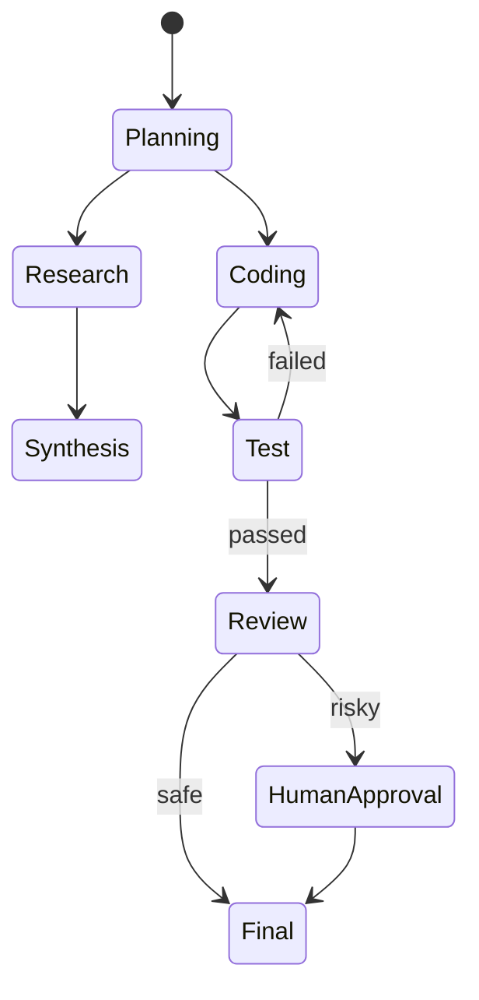

# 图 / 状态机 / 工作流

## 定义

将智能体流程建模为显式图、状态机或工作流——而非让大语言模型决定每一次转换。

**类别**：控制结构

## 结构



## 适用场景

生产系统、可恢复任务、长时间运行工作、需要审计追踪和权限边界的智能体平台。

## 不适用场景

轻量级演示、纯对话、或流程完全未知的探索性任务。

## 实现方法

1. 将流程建模为 `节点 + 边 + 状态`。
2. 大语言模型可以选择边，但不能绕过状态机约束。
3. 每个节点都应可重放、可恢复、可取消。
4. 图状态存储消息、工具调用、任务状态和权限状态。

## 最小伪代码

```ts
type Node = "plan" | "research" | "code" | "test" | "review" | "final";
type Edge = (state: State) => Node;

while (state.node !== "final") {
  const output = await runNode(state.node, state);
  state = checkpoint({ ...state, ...output });
  state.node = route(state);
}
```

## 推荐的追踪事件

- `workflow.node.enter`
- `workflow.node.exit`
- `workflow.edge.selected`
- `workflow.checkpoint.created`

## 常见失败模式

- 图过于僵化，智能体失去灵活性。
- 状态字段分散，导致恢复困难。
- 大语言模型路由与业务规则冲突。

## 实现检查清单

- [ ] 输入/输出模式已定义。
- [ ] 每个智能体的权限边界已定义。
- [ ] 每次智能体调用都携带运行标识 / 追踪标识。
- [ ] 失败、超时、取消和重试策略已定义。
- [ ] 传递的上下文是最小必需的，而非完整历史。
- [ ] 高风险操作由审批或验证器把关。

## 参考

- [Microsoft Agent Framework](https://learn.microsoft.com/en-us/agent-framework/overview/)
- [Google architecture patterns](https://docs.cloud.google.com/architecture/choose-design-pattern-agentic-ai-system)
- [LangChain multi-agent](https://docs.langchain.com/oss/python/langchain/multi-agent)
