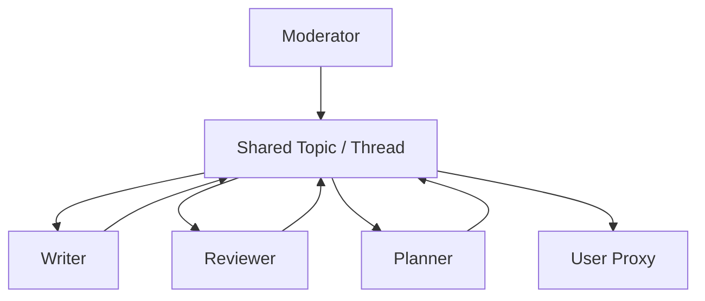

# 群聊会议

## 定义

多个智能体共享一个消息线程或主题。由规则、大语言模型选择器或人工主持人决定下一个发言者。

**类别**：信息流

## 结构



## 适用场景

头脑风暴、架构评审、多视角讨论、模拟产品 / 设计 / 工程会议。

## 不适用场景

当需要确定性流程、低成本、强审计追踪或严格权限边界时。

## 实现方式

1. 定义参与者、角色、发言选择规则和终止条件。
2. 使用主持人选择下一个发言者——轮询、基于规则或大语言模型选择器。
3. 仅在共享线程中保留必要信息；剔除离题消息。
4. 定期总结线程内容，以控制 Token 消耗。

## 最小伪代码

```ts
while (!termination(thread)) {
  const speaker = await moderator.selectSpeaker(thread, agents);
  const msg = await speaker.reply(thread);
  thread.append({ speaker: speaker.name, content: msg });
}
return summarizer.run(thread);
```

## 推荐追踪事件

- `groupchat.speaker.selected`
- `groupchat.message.appended`
- `groupchat.terminated`
- `groupchat.summary.created`

## 常见失效模式

- 对话偏离主题。
- Token 成本快速增长。
- 弱势智能体被强势智能体裹挟。
- 未产出具体成果。

## 实现检查清单

- [ ] 输入/输出模式已定义。
- [ ] 每个智能体的权限边界已定义。
- [ ] 每次智能体调用都携带运行 ID / 追踪 ID。
- [ ] 失败、超时、取消和重试策略已定义。
- [ ] 传递的上下文是最小必要的，而非完整历史。
- [ ] 高风险操作由审批或验证器把关。

## 参考

- [AutoGen patterns](https://microsoft.github.io/autogen/0.2/docs/tutorial/conversation-patterns/)
- [AutoGen group chat](https://microsoft.github.io/autogen/stable/user-guide/core-user-guide/design-patterns/group-chat.html)
