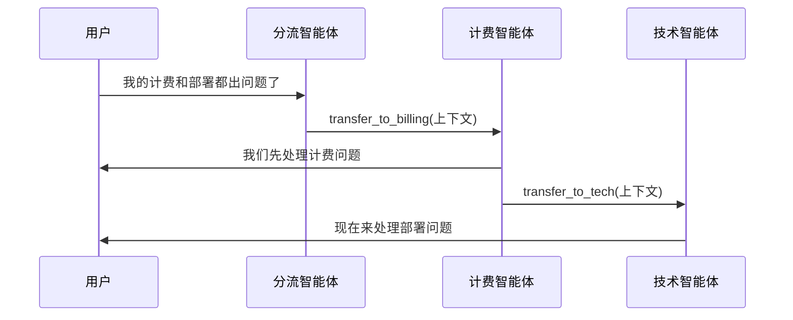

# 交接 / 路由器 / 转移

## 定义

活动智能体将对话控制权转移给另一个智能体，后者接管剩余的交互。

**类别**: 控制结构

## 结构



## 何时使用

支持/售后分流、领域专家切换、专家需要直接向用户提问的多轮工作流。

## 何时不使用

当子任务只是一次性查询，或交接标准模糊导致对话来回弹跳时。

## 如何实现

1. 每个智能体声明它接受哪些 `handoff_intents`。
2. 交接不是函数调用 —— 它改变哪个智能体处于活动状态。
3. 传递精简的上下文：用户目标、已完成项、未决项、权限边界。
4. 设置最大交接次数并检测循环。
5. 记录每次交接，包含 `来源 / 目标 / 原因 / 上下文摘要`。

## 最小伪代码

```ts
async function maybeHandoff(state: SessionState) {
  const decision = await router.classify(state.lastMessage, state.activeAgent);
  if (decision.type === "handoff") {
    assert(!state.handoffHistory.includesLoop(decision.to));
    return {
      ...state,
      activeAgent: decision.to,
      handoffHistory: [...state.handoffHistory, decision]
    };
  }
  return state;
}
```

## 推荐追踪事件

- `handoff.requested`
- `handoff.accepted`
- `handoff.rejected`
- `handoff.loop_detected`

## 常见失败模式

- 交接原因未记录 → 无法调试。
- 完整上下文被转移，污染接收智能体。
- 智能体之间的循环。
- 用户不知道面前是哪个智能体。

## 实现检查清单

- [ ] 输入/输出模式已定义。
- [ ] 每个智能体的权限边界已定义。
- [ ] 每次智能体调用携带运行 ID / 追踪 ID。
- [ ] 失败、超时、取消和重试策略已定义。
- [ ] 传递的上下文是最小必要的，而非完整历史。
- [ ] 高风险操作由审批或验证器把关。

## 参考资料

- [OpenAI handoffs](https://openai.github.io/openai-agents-python/handoffs/)
- [LangChain handoffs](https://docs.langchain.com/oss/python/langchain/multi-agent/handoffs)
