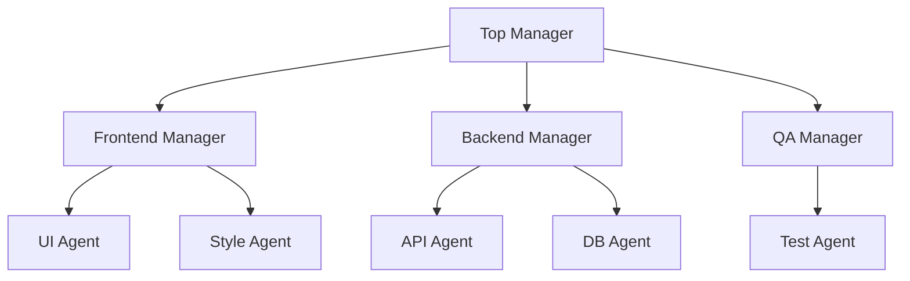

# 层级分解

## 定义

多层级的管理者-工作者结构。上层负责规划和分解；下层负责执行，且自身也可以进一步分解。

**类别**：控制结构

## 结构



## 适用场景

大型工程项目、长期运行的工作、跨团队协作、企业流程自动化。

## 不适用场景

小型任务、低延迟任务，或任务边界不明确的开放式聊天。

## 实现方式

1. 每一层只处理其自身层级——不允许跳过层级去微观管理工作者。
2. 每个子任务都有明确的验收标准和输出模式。
3. 限制递归深度和每层扇出数量。
4. 上层仅接收摘要、证据和状态——而非工作者的完整上下文。

## 最小伪代码

```ts
async function decompose(node: TaskNode, depth = 0) {
  if (depth > MAX_DEPTH || node.isAtomic()) return worker.run(node);
  const children = await manager.plan(node);
  const results = await Promise.all(children.map(c => decompose(c, depth + 1)));
  return manager.aggregate(node, results);
}
```

## 推荐追踪事件

- `hierarchy.node.created`
- `hierarchy.node.assigned`
- `hierarchy.node.completed`
- `hierarchy.depth_limited`

## 常见失效模式

- 深层级导致高延迟。
- 顶层的糟糕计划会使下方所有分支都偏离轨道。
- 工作者的失败被管理者的摘要所掩盖。

## 实现检查清单

- [ ] 输入/输出模式已定义。
- [ ] 每个智能体的权限边界已定义。
- [ ] 每次智能体调用都携带运行 ID / 追踪 ID。
- [ ] 失败、超时、取消和重试策略已定义。
- [ ] 传递的上下文是最小必要的，而非完整历史。
- [ ] 高风险操作由审批或验证器把关。

## 参考

- [Google ADK patterns](https://developers.googleblog.com/developers-guide-to-multi-agent-patterns-in-adk/)
- [Survey of communication](https://arxiv.org/html/2502.14321v2)
