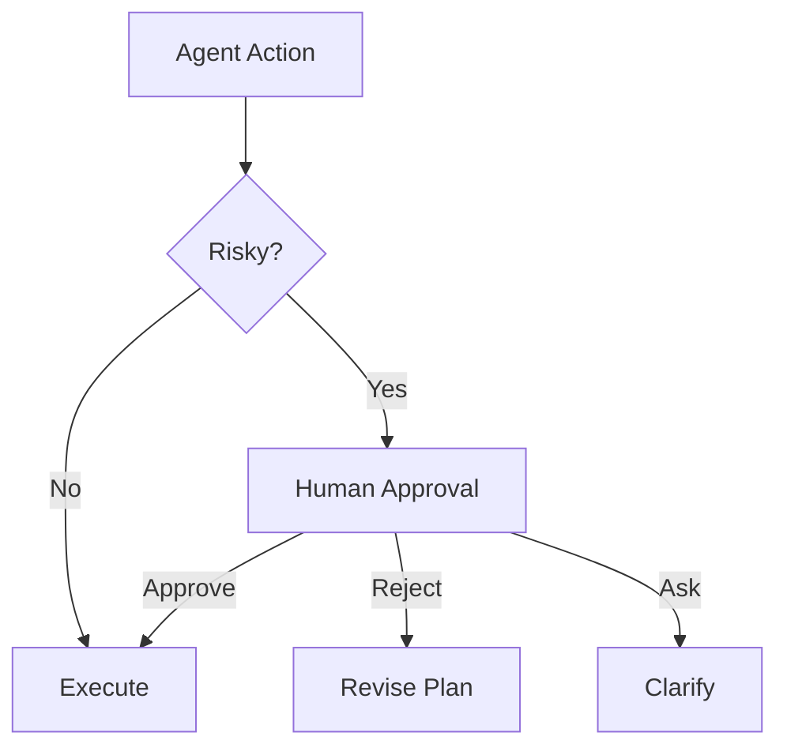

# 人在回路（HITL）

## 定义

将人视为一种参与审批、纠错、路由、中断或最终决策的特殊智能体。

**类别**：执行环境

## 结构



## 适用场景

高风险操作：Shell 命令、文件写入、代码提交、部署、金融操作、法律事务、隐私处理、权限变更。

## 不适用场景

完全自动化的、低风险的内部起草工作。

## 实现方式

1. 定义操作风险等级：`read / write / shell / network / deploy / payment`。
2. 高风险操作进入审批队列。
3. 审批卡片必须展示：操作内容、原因、范围、回滚方案。
4. 人工反馈回流到智能体状态——而非仅仅是外部评论。

## 最小伪代码

```ts
if (policy.requiresApproval(action)) {
  const approval = await humanApproval.request({ action, reason, rollback });
  if (!approval.granted) return revisePlan(approval.feedback);
}
return execute(action);
```

## 推荐追踪事件

- `approval.requested`
- `approval.granted`
- `approval.rejected`
- `approval.timeout`

## 常见失效模式

- 审批请求未携带足够的上下文以支持真实决策。
- 所有操作都需要审批；系统变得无法使用。
- 审批后，缺乏上下文和问责记录。

## 实现检查清单

- [ ] 输入/输出模式已定义。
- [ ] 每个智能体的权限边界已定义。
- [ ] 每次智能体调用都携带运行 ID / 追踪 ID。
- [ ] 失败、超时、取消和重试策略已定义。
- [ ] 传递的上下文是最小必要的，而非完整历史。
- [ ] 高风险操作由审批或验证器把关。

## 参考

- [Google ADK patterns](https://developers.googleblog.com/developers-guide-to-multi-agent-patterns-in-adk/)
- [Microsoft Agent Framework](https://learn.microsoft.com/en-us/agent-framework/overview/)
