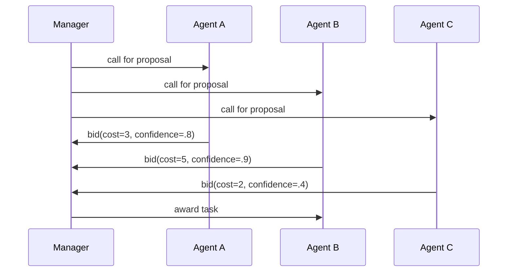

# 市场 / 拍卖 / 合同网

## 定义

智能体通过竞价、定价或合同网协议来分配任务和资源。

**类别**：决策

## 结构



## 适用场景

资源调度、工具成本优化、机器人任务分配、多智能体负载均衡。

## 不适用场景

当竞价无法成为可信估算时、任务极小时，或协商成本超过执行成本时。

## 实现方式

1. 管理者发布任务公告，包含目标、约束、预算和验收标准。
2. 智能体返回竞价：成本、预计时间、置信度、所需权限。
3. 管理者通过评分函数选择中标者。
4. 任务完成后更新智能体声誉——抑制长期恶意低价竞标。

## 最小伪代码

```ts
const bids = await Promise.all(agents.map(a => a.bid(task)));
const winner = rank(bids, b => b.confidence / Math.max(b.cost, 1))[0];
const result = await winner.agent.run(task);
reputation.update(winner.agent, result);
```

## 推荐追踪事件

- `auction.announced`
- `auction.bid.received`
- `auction.awarded`
- `auction.completed`

## 常见失效模式

- 智能体低估成本。
- 评分函数被钻空子，而非真正解决任务。
- 协商 Token 消耗占据预算大头。

## 实现检查清单

- [ ] 输入/输出模式已定义。
- [ ] 每个智能体的权限边界已定义。
- [ ] 每次智能体调用都携带运行 ID / 追踪 ID。
- [ ] 失败、超时、取消和重试策略已定义。
- [ ] 传递的上下文是最小必要的，而非完整历史。
- [ ] 高风险操作由审批或验证器把关。

## 参考

- [Survey of communication](https://arxiv.org/html/2502.14321v2)
