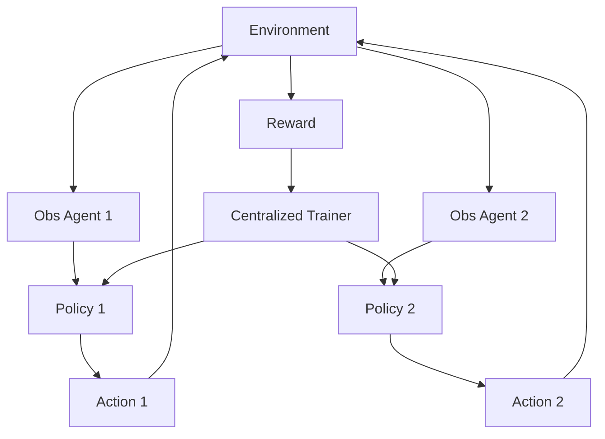

# 多智能体强化学习（MARL/CTDE）

## 定义

多智能体强化学习通过奖励机制训练多个智能体在环境中协作或竞争。CTDE 即**C**entralized **T**raining（集中训练）、**D**ecentralized **E**xecution（分散执行）。

**类别**：学习

## 结构



## 适用场景

机器人、游戏、交通、调度、控制系统、多智能体协作决策研究。

## 不适用场景

日常的大语言模型编程智能体编排。如果你无法定义奖励函数和模拟器，就不要使用多智能体强化学习。

## 实现方式

1. 定义环境、观测空间、动作空间、奖励和回合。
2. 选择训练范式：CTE（集中训练集中执行）、CTDE（集中训练分散执行）或 DTE（分散训练分散执行）。
3. 训练可以使用全局状态；执行仅使用局部观测。
4. 对于大语言模型智能体平台，多智能体强化学习更适合策略研究，而非作为主要运行时。

## 最小伪代码

```ts
for (const episode of episodes) {
  let obs = env.reset();
  while (!env.done()) {
    const actions = agents.map((a, i) => a.policy(obs[i]));
    const { nextObs, rewards } = env.step(actions);
    trainer.update({ obs, actions, rewards, nextObs });
    obs = nextObs;
  }
}
```

## 推荐追踪事件

- `marl.episode.started`
- `marl.step.completed`
- `marl.reward.received`
- `marl.policy.updated`

## 常见失效模式

- 奖励函数定义错误。
- 训练环境与生产环境不匹配。
- 将多智能体强化学习与通用大语言模型编排混为一谈。

## 实现检查清单

- [ ] 触发和退出条件已定义。
- [ ] 输入/输出模式已定义。
- [ ] 权限、预算、超时和重试策略已定义。
- [ ] 追踪事件已定义。
- [ ] 降级或人工接管策略已定义。

## 参考

- [MARL / CTDE intro](https://arxiv.org/abs/2409.03052)
- [MARL survey](https://arxiv.org/abs/2405.06161v2/)
