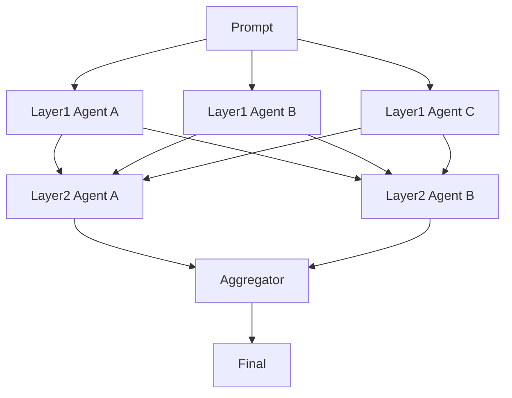

# 智能体混合 / 分层集成

## 定义

多个模型或智能体分层生成；每一后续层读取多个前层输出并在此基础上改进。

**类别**：决策

## 结构



## 适用场景

多模型融合、高质量生成、创意任务、答案综合。

## 不适用场景

低延迟任务、需要实际工具执行的任务，或预算敏感的工作负载。

## 实现方式

1. 第一层使用多样化的模型 / 提示，以避免同质化输出。
2. 后续层读取前层输出，而非仅读取原始提示。
3. 聚合器负责去重、冲突解决和质量排序。
4. 限制层数——通常 2 或 3 层已足够。

## 最小伪代码

```ts
let layerOutputs = await Promise.all(layer1.map(a => a.run(prompt)));
for (const layer of nextLayers) {
  layerOutputs = await Promise.all(layer.map(a => a.run({ prompt, previous: layerOutputs })));
}
return aggregator.run({ prompt, candidates: layerOutputs });
```

## 推荐追踪事件

- `moa.layer.started`
- `moa.agent.output`
- `moa.layer.completed`
- `moa.aggregated`

## 常见失效模式

- 模型输出过于相关；收益达到瓶颈。
- 延迟和成本急剧膨胀。
- 聚合器合并了相互冲突的结论。

## 实现检查清单

- [ ] 输入/输出模式已定义。
- [ ] 每个智能体的权限边界已定义。
- [ ] 每次智能体调用都携带运行 ID / 追踪 ID。
- [ ] 失败、超时、取消和重试策略已定义。
- [ ] 传递的上下文是最小必要的，而非完整历史。
- [ ] 高风险操作由审批或验证器把关。

## 参考

- [Mixture-of-Agents (MoA)](https://arxiv.org/abs/2406.04692)
