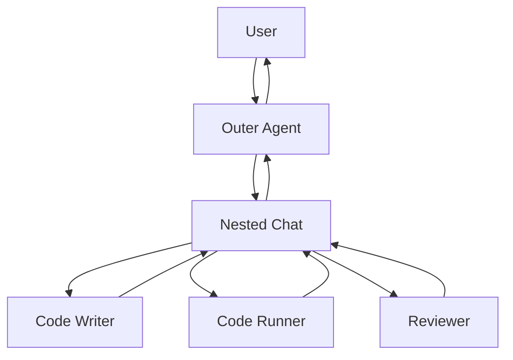

# 嵌套聊天

## 定义

在对外回复之前，智能体触发一个小型的内部多智能体对话，以完成复杂的子流程。

**类别**：信息流

## 结构



## 适用场景

将复杂流程封装为单个智能体、内部评审/测试循环、可复用的专业团队。

## 不适用场景

当用户需要看到每一个中间步骤，或内部团队的成本无上限时。

## 实现方式

1. 外层智能体在启动嵌套聊天前必须有明确的触发条件。
2. 嵌套聊天拥有独立的记忆和终止条件。
3. 外层智能体仅接收结构化摘要，而非完整的内部对话记录。
4. 追踪应保留嵌套运行 ID，以便展开查看。

## 最小伪代码

```ts
async function outerReply(message) {
  if (needsInternalReview(message)) {
    const inner = await nestedTeam.run({ task: message, maxTurns: 6 });
    return outerAgent.finalize({ message, innerSummary: inner.summary });
  }
  return outerAgent.reply(message);
}
```

## 推荐追踪事件

- `nested_chat.started`
- `nested_chat.turn`
- `nested_chat.completed`
- `nested_chat.summary.returned`

## 常见失效模式

- 内部对话不可见，难以审计。
- 外层智能体过于激进地触发嵌套聊天。
- 内部团队的输出未经验证。

## 实现检查清单

- [ ] 输入/输出模式已定义。
- [ ] 每个智能体的权限边界已定义。
- [ ] 每次智能体调用都携带运行 ID / 追踪 ID。
- [ ] 失败、超时、取消和重试策略已定义。
- [ ] 传递的上下文是最小必要的，而非完整历史。
- [ ] 高风险操作由审批或验证器把关。

## 参考

- [AutoGen patterns](https://microsoft.github.io/autogen/0.2/docs/tutorial/conversation-patterns/)
