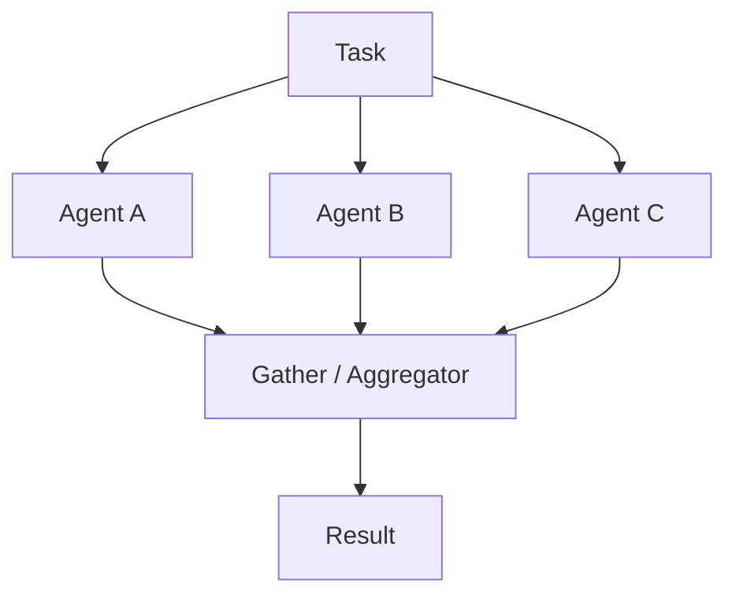

# 并行扇出 / 汇聚

## 定义

将一个任务拆分到多个智能体并发执行，然后由聚合器合并、投票或综合结果。

**类别**：信息流

## 结构



## 适用场景

多视角探索、并行检索、并行代码阅读、日志分析、模型集成。

## 不适用场景

当任务强依赖执行顺序、分支需要共享可变状态，或预算紧张时。

## 实现方式

1. 扇出前，为每个分支设定不同的目标——避免重复工作。
2. 分支默认共享只读上下文，绝不共享工作空间。
3. 汇聚步骤执行去重、冲突检测和证据合并——而非简单拼接。
4. 配置并发数、超时、取消和预算上限。

## 最小伪代码

```ts
const branches = plan.branches.map(branch =>
  runWithTimeout(agentFor(branch).run(branch), branch.timeoutMs)
);
const results = await Promise.allSettled(branches);
return aggregator.run({ task, results });
```

## 推荐追踪事件

- `fanout.started`
- `branch.started`
- `branch.completed`
- `branch.timeout`
- `gather.started`
- `gather.completed`

## 常见失效模式

- 多个智能体执行相同的工作。
- 聚合器静默合并了相互矛盾的结论。
- 并发写入破坏了共享工作空间。

## 实现检查清单

- [ ] 输入/输出模式已定义。
- [ ] 每个智能体的权限边界已定义。
- [ ] 每次智能体调用都携带运行 ID / 追踪 ID。
- [ ] 失败、超时、取消和重试策略已定义。
- [ ] 传递的上下文是最小必要的，而非完整历史。
- [ ] 高风险操作由审批或验证器把关。

## 参考

- [Google ADK patterns](https://developers.googleblog.com/developers-guide-to-multi-agent-patterns-in-adk/)
