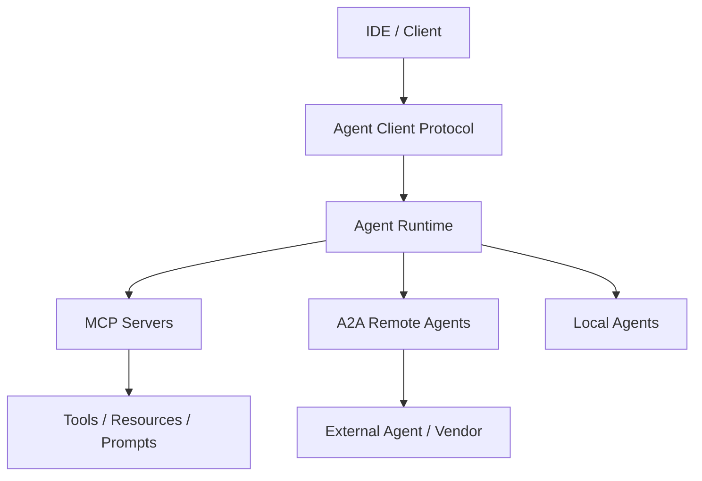

# 协议中介的智能体网络

## 定义

使用标准协议——MCP、A2A、ACP、Agent Client Protocol——跨框架和厂商连接工具、智能体、客户端和平台。

**类别**：协议互联

## 结构



## 适用场景

跨框架互操作、企业集成、IDE 到编程智能体、工具生态标准化。

## 不适用场景

单体演示、所有工具均为本地且无需标准化的环境。

## 实现方式

1. MCP 用于智能体到工具/资源的调用——不要将其复用于智能体之间的通信。
2. A2A / ACP 处理智能体发现、任务、消息和协作。
3. Agent Client Protocol 覆盖 IDE/客户端到编程智能体的连接。
4. 所有协议边界都需要认证、授权、审计和速率限制。

## 最小伪代码

```ts
interface AgentRuntimePorts {
  mcp: MCPClient;                 // tools / resources / prompts
  a2a: AgentDirectoryClient;      // remote agents
  client: AgentClientServer;      // IDE / web / CLI
  events: EventBus;               // observability
}
```

## 推荐追踪事件

- `protocol.mcp.tool_call`
- `protocol.a2a.task.created`
- `protocol.client.session.started`
- `protocol.auth.failed`

## 常见失效模式

- 将 MCP、A2A 和 Agent Client Protocol 混为一个协议。
- 外部智能体被授予过多权限。
- 缺乏身份识别或审计。

## 实现检查清单

- [ ] 输入/输出模式已定义。
- [ ] 每个智能体的权限边界已定义。
- [ ] 每次智能体调用都携带运行 ID / 追踪 ID。
- [ ] 失败、超时、取消和重试策略已定义。
- [ ] 传递的上下文是最小必要的，而非完整历史。
- [ ] 高风险操作由审批或验证器把关。

## 参考

- [MCP specification](https://modelcontextprotocol.io/specification/2025-06-18)
- [MCP tools](https://modelcontextprotocol.io/specification/2025-06-18/server/tools)
- [A2A docs](https://a2a-protocol.org/latest/)
- [A2A — Google blog](https://developers.googleblog.com/en/a2a-a-new-era-of-agent-interoperability/)
- [Agent Client Protocol](https://agentclientprotocol.com/get-started/introduction)
