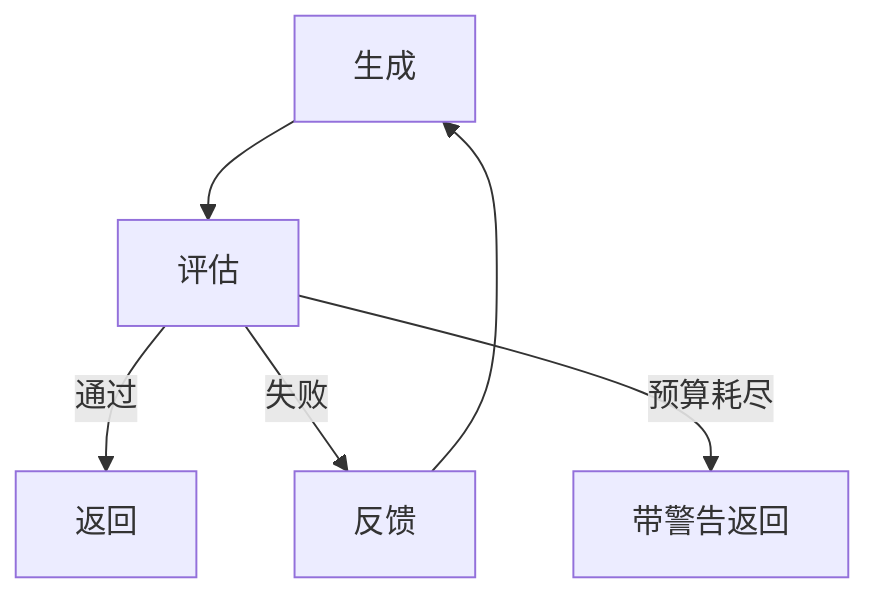

# 精化循环

## 定义

迭代执行生成 → 评估 → 修订，直到满足退出条件或预算耗尽。

**类别**：决策

## 结构



## 适用场景

测试驱动的代码修复、文档润色、提示词优化、方案迭代、质量门禁。

## 不适用场景

没有明确的评估标准、没有定义退出条件、或预算紧张时。

## 实现方法

1. 预先定义退出条件：测试通过、分数超过阈值、人工审批、无新问题。
2. 每一轮只修改明确的失败点 —— 避免震荡。
3. 记录每轮的差异、分数、反馈和成本。
4. 达到最大轮次时，返回当前状态和未解决的问题。

## 最小伪代码

```ts
for (let round = 1; round <= maxRounds; round++) {
  const output = await worker.run(state);
  const evalResult = await evaluator.run(output);
  logRound(round, output, evalResult);
  if (evalResult.pass) return output;
  state = applyFeedback(state, evalResult.feedback);
}
return { status: "incomplete", state };
```

## 推荐追踪事件

- `loop.round.started`
- `loop.evaluation.completed`
- `loop.exit.pass`
- `loop.exit.budget_exceeded`

## 常见失败模式

- 退出条件模糊导致无限循环。
- 每一轮引入新缺陷。
- 系统优化的是评估器的分数，而非真实目标。

## 实现检查清单

- [ ] 输入/输出模式已定义。
- [ ] 每个智能体的权限边界已定义。
- [ ] 每次智能体调用都携带运行 ID / 追踪 ID。
- [ ] 失败、超时、取消和重试策略已定义。
- [ ] 传递的上下文是最小必需的，而非完整历史。
- [ ] 高风险操作由审批或验证器把关。

## 参考资料

- [Google ADK 模式](https://developers.googleblog.com/developers-guide-to-multi-agent-patterns-in-adk/)
- [Google 架构模式](https://docs.cloud.google.com/architecture/choose-design-pattern-agentic-ai-system)
