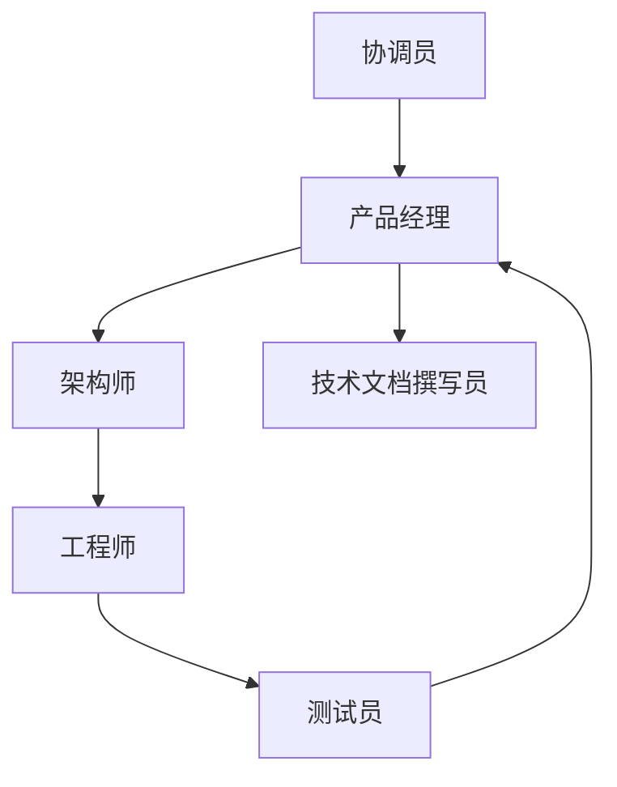

# 角色扮演 SOP

## 定义

为智能体分配专业角色 —— 产品、架构、开发、QA —— 并通过标准操作程序约束其协作方式。

**类别**：执行环境

## 结构



## 适用场景

虚拟软件公司、产品设计、教学模拟、组织流程自动化。

## 不适用场景

角色只是装饰 —— 没有工具、没有验收标准。

## 实现方法

1. 每个角色声明职责边界、允许使用的工具以及输入/输出格式。
2. SOP 应编码为工作流，而非仅 buried 在提示词中。
3. 角色交接应产出工件，而非仅聊天记录。
4. 对于软件开发任务，接入真实的测试执行和代码运行。

## 最小伪代码

```ts
const sop = [
  { role: "PM", output: "requirements.md" },
  { role: "Architect", output: "design.md" },
  { role: "Engineer", output: "patch.diff" },
  { role: "Tester", output: "test-report.md" },
];

for (const step of sop) await role(step.role).run(step);
```

## 推荐追踪事件

- `role.task.started`
- `role.artifact.created`
- `sop.step.completed`
- `sop.violation.detected`

## 常见失败模式

- 智能体角色扮演得很好，但没有产出实际输出。
- SOP 篇幅膨胀，成本激增。
- 角色输出不遵循一致的工件格式。

## 实现检查清单

- [ ] 输入/输出模式已定义。
- [ ] 每个智能体的权限边界已定义。
- [ ] 每次智能体调用都携带运行 ID / 追踪 ID。
- [ ] 失败、超时、取消和重试策略已定义。
- [ ] 传递的上下文是最小必需的，而非完整历史。
- [ ] 高风险操作由审批或验证器把关。

## 参考资料

- [Survey: LLM-based multi-agent](https://arxiv.org/html/2412.17481v2)
