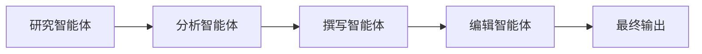

# 顺序流水线

## 定义

任务按固定顺序流经多个智能体；每一步的输出成为下一步的输入。

**类别**：信息流

## 结构



## 适用场景

研究 → 分析 → 撰写，需求 → 设计 → 构建 → 测试，ETL 风格的明确定义流程。

## 不适用场景

任务结构未知，或需要大量动态分支或并行探索时。

## 实现方法

1. 将流程建模为固定步骤；每一步声明输入/输出模式。
2. 验证每一步的输出 —— 不要在步骤之间传递原始自然语言。
3. 允许在失败时对单步进行重试，而非重新运行整个流水线。
4. 在关键节点插入验证器或人工审批。

## 最小伪代码

```ts
const pipeline = [researchAgent, analystAgent, writerAgent, editorAgent];
let state = { input: userTask };
for (const agent of pipeline) {
  state = await agent.run(state);
  validate(agent.outputSchema, state);
}
return state.final;
```

## 推荐追踪事件

- `pipeline.started`
- `pipeline.step.started`
- `pipeline.step.completed`
- `pipeline.completed`

## 常见失败模式

- 上游的幻觉被下游重新包装，变得更具可信度。
- 固定流程不适合动态任务。
- 缺少单步检查点。

## 实现检查清单

- [ ] 输入/输出模式已定义。
- [ ] 每个智能体的权限边界已定义。
- [ ] 每次智能体调用都携带运行 ID / 追踪 ID。
- [ ] 失败、超时、取消和重试策略已定义。
- [ ] 传递的上下文是最小必需的，而非完整历史。
- [ ] 高风险操作由审批或验证器把关。

## 参考资料

- [Google ADK 模式](https://developers.googleblog.com/developers-guide-to-multi-agent-patterns-in-adk/)
- [AutoGen 模式](https://microsoft.github.io/autogen/0.2/docs/tutorial/conversation-patterns/)
