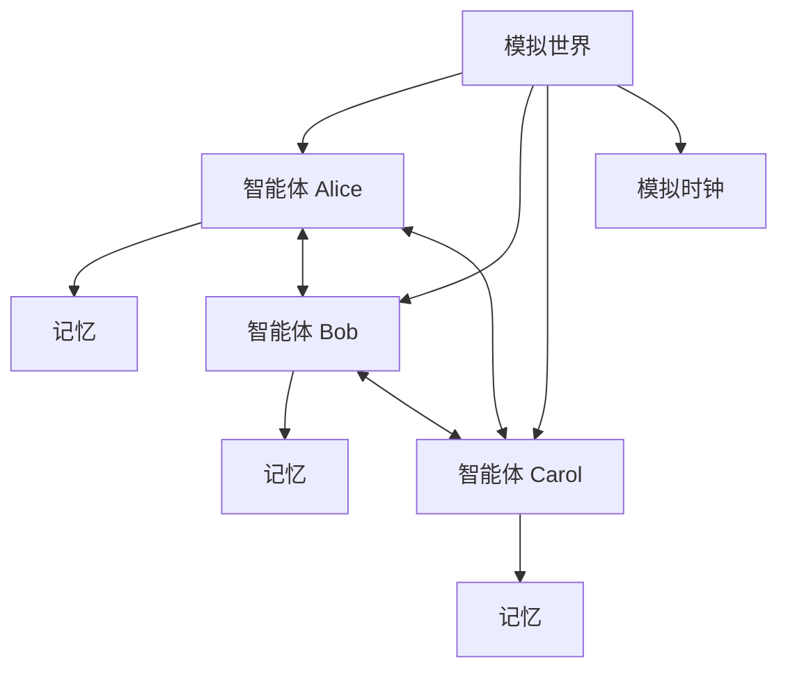

# 社会模拟 / 智能体社会

## 定义

使用多个智能体模拟人群、组织、社区或社会系统。重点是长期记忆、规划、关系和涌现行为。

**类别**：模拟

## 结构



## 适用场景

用户研究、产品验证、社会行为模拟、游戏 NPC、组织建模、信息传播研究。

## 不适用场景

生产任务执行、强确定性流程、需要编码智能体执行实际工作的场景。

## 实现方法

1. 设计世界状态：位置、时间、事件、对象、关系。
2. 每个智能体拥有记忆、档案、目标和每日计划。
3. 使用 `观察 → 反思 → 规划 → 行动` 循环。
4. 记录智能体交互和世界状态变化。
5. 目标是模拟可信度，而非单任务成功率。

## 最小伪代码

```ts
async function tick(world) {
  for (const agent of world.agents) {
    const obs = world.observe(agent);
    agent.memory.store(obs);
    const reflection = await agent.reflect();
    const plan = await agent.plan(reflection);
    await world.apply(await agent.act(plan));
  }
}
```

## 推荐追踪事件

- `simulation.tick.started`
- `agent.observed`
- `agent.reflected`
- `agent.acted`
- `world.state.updated`

## 常见失败模式

- 将模拟结果当作真实预测。
- 人设令人信服但行为未经验证。
- 长期记忆污染未来运行。

## 实现检查清单

- [ ] 触发和退出条件已定义。
- [ ] 输入/输出模式已定义。
- [ ] 权限、预算、超时和重试策略已定义。
- [ ] 追踪事件已定义。
- [ ] 降级或人工接管策略已定义。

## 参考资料

- [Generative agents](https://arxiv.org/abs/2304.03442)
