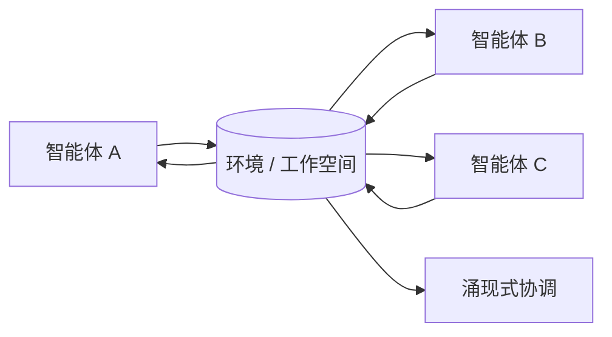

# 环境媒介协作

## 定义

智能体不直接通信。它们修改环境并留下痕迹；其他智能体观察这些痕迹并采取行动。对于编码智能体，问题、待办事项、差异对比和测试结果都是环境痕迹。

**类别**：执行环境

## 结构



## 适用场景

机器人技术、模拟、制造、共享工作空间、异步研究协作 —— 任何不需要直接对话的场景。

## 不适用场景

环境状态不可观察、痕迹没有模式，或需要强因果解释时。

## 实现方法

1. 结构化环境痕迹：`待办事项 / 工件 / 测试结果 / 问题 / 决策`。
2. 智能体定期观察环境变化，而非接收直接消息。
3. 每条痕迹携带来源、时间戳、有效性和置信度。
4. 对于编码智能体，将 `TODO.md`、测试报告、git 差异视为间接协作信号。

## 最小伪代码

```ts
async function agentLoop(agent) {
  const observations = await environment.observe(agent.scope);
  const action = await agent.decide(observations);
  await environment.apply(action);
  await eventBus.publish({
    type: "environment.trace.left",
    actor: agent.id,
    payload: action,
  });
}
```

## 推荐追踪事件

- `environment.observed`
- `environment.trace.left`
- `environment.trace.consumed`
- `environment.conflict.detected`

## 常见失败模式

- 环境污染。
- 智能体读取过时的痕迹。
- 痕迹过于隐式，调试困难。

## 实现检查清单

- [ ] 触发和退出条件已定义。
- [ ] 输入/输出模式已定义。
- [ ] 权限、预算、超时和重试策略已定义。
- [ ] 追踪事件已定义。
- [ ] 降级或人工接管策略已定义。

## 参考资料

- [Survey of communication](https://arxiv.org/html/2502.14321v2)
