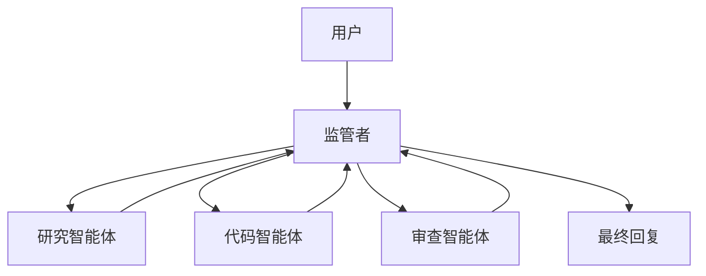

# Supervisor/Manager

## 定义

主智能体规划、路由和综合结果；其他智能体作为执行子任务的专家。

**类别**: 控制结构

## 结构



## 何时使用

生产系统、任务分解、客户支持分流、内部研发平台、任何需要稳定控制和可观测性的场景。

## 何时不使用

开放式探索、智能体间的自由协商、或监管者无法有效评估子任务质量的场景。

## 如何实现

1. 定义一个 `SupervisorAgent`，只做意图识别、规划、路由和综合 —— 从不做重活。
2. 每个专家有自己的指令、工具集、内存范围和权限。
3. 监管者调用子智能体时传递结构化任务：`目标 / 上下文 / 约束 / 预期输出`。
4. 子智能体返回结构化结果：`状态 / 答案 / 证据 / 后续行动 / 置信度`。
5. 监管者决定下一步：再次调用、并行扇出、进入验证器、请求用户确认或定稿。

## 最小伪代码

```ts
type AgentResult = {
  status: "success" | "blocked" | "need_input" | "failed";
  answer: string;
  evidence?: string[];
  confidence?: number;
};

async function supervisor(task: UserTask) {
  const plan = await planner.run(task);
  const results = [];
  for (const step of plan.steps) {
    const agent = registry.pick(step.requiredSkill);
    results.push(await agent.run({ goal: step.goal, context: task.context }));
  }
  return synthesizer.run({ task, results });
}
```

## 推荐追踪事件

- `supervisor.plan.created`
- `agent.task.assigned`
- `agent.result.received`
- `supervisor.synthesis.completed`

## 常见失败模式

- 监管者成为瓶颈；所有错误集中在一个节点上。
- 子智能体输出不可验证；监管者盲目信任。
- 完整上下文被倾倒进监管者，令牌爆炸并抹除权限边界。

## 实现检查清单

- [ ] 输入/输出模式已定义。
- [ ] 每个智能体的权限边界已定义。
- [ ] 每次智能体调用携带运行 ID / 追踪 ID。
- [ ] 失败、超时、取消和重试策略已定义。
- [ ] 传递的上下文是最小必要的，而非完整历史。
- [ ] 高风险操作由审批或验证器把关。

## 参考资料

- [OpenAI Agents — 指南](https://developers.openai.com/api/docs/guides/agents)
- [LangChain 多智能体](https://docs.langchain.com/oss/python/langchain/multi-agent)
- [Google ADK 模式](https://developers.googleblog.com/developers-guide-to-multi-agent-patterns-in-adk/)
