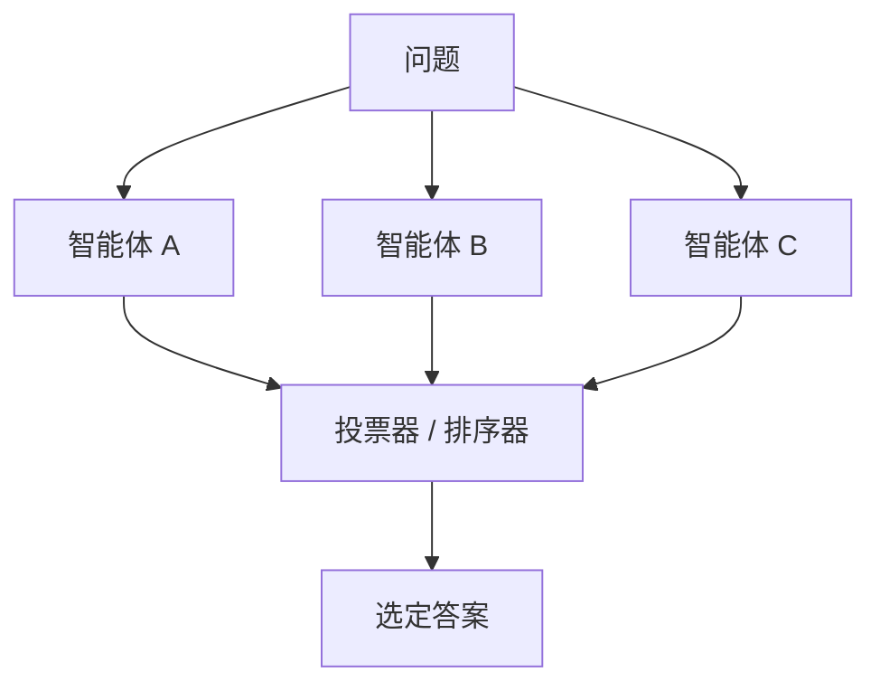

# 投票集成

## 定义

多个智能体独立产生候选答案；投票、排序、评分或验证器选择最终结果。

**类别**：决策

## 结构



## 适用场景

分类、推理问题、多候选方案、事实核查、模型融合、基准评估。

## 不适用场景

候选答案高度相关、所有智能体共享同一错误源，或任务需要工具验证而非投票时。

## 实现方法

1. 使用不同的模型、提示词、温度或工具路径以最大化多样性。
2. 每个候选答案携带推理和证据，以便排序器评判。
3. 排序器使用评分标准，而非"看起来最好的"。
4. 对于可执行任务，用工具验证获胜的候选答案。

## 最小伪代码

```ts
const candidates = await Promise.all(agents.map(a => a.answer(question)));
const scored = await ranker.score({ question, candidates, rubric });
const winner = scored.sort((a, b) => b.score - a.score)[0];
return verifier ? verifier.check(winner) : winner;
```

## 推荐追踪事件

- `ensemble.candidate.created`
- `ensemble.vote.cast`
- `ensemble.ranked`
- `ensemble.winner.selected`

## 常见失败模式

- 多数答案不正确。
- 候选答案过于相似。
- 排序器被流畅的文笔所欺骗。

## 实现检查清单

- [ ] 触发和退出条件已定义。
- [ ] 输入/输出模式已定义。
- [ ] 权限、预算、超时和重试策略已定义。
- [ ] 追踪事件已定义。
- [ ] 降级或人工接管策略已定义。

## 参考资料

- [Survey: LLM-based multi-agent](https://arxiv.org/html/2412.17481v2)
- [Mixture-of-Agents (MoA)](https://arxiv.org/abs/2406.04692)
