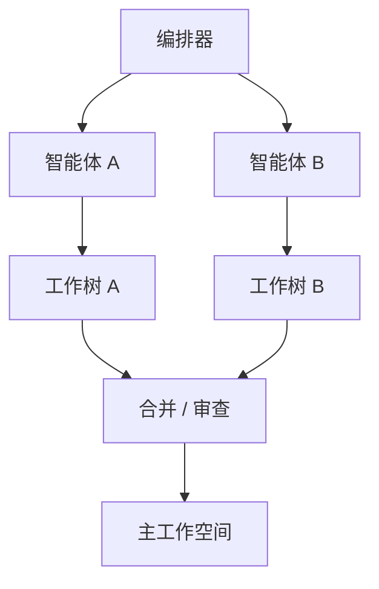

# 工作空间 / 沙箱隔离

## 定义

不同的智能体在独立的工作空间、git 工作树、容器或沙箱中执行，以避免并发冲突。

**类别**：执行环境

## 结构



## 适用场景

编码智能体、多智能体并发代码修改、实验性方案、危险命令、测试环境隔离。

## 不适用场景

只读任务、简单问答、没有文件系统副作用的任务。

## 实现方法

1. 每次智能体运行创建自己的工作空间或工作树。
2. 文件写入、命令执行和测试都在隔离环境中运行。
3. 输出以补丁 / 差异 / 工件的形式返回主流程。
4. 合并前，审查员/测试员检查冲突和测试结果。
5. 支持快照、回滚、清理。

## 最小伪代码

```ts
async function runInWorkspace(agent, task) {
  const ws = await workspace.create({ baseRef: task.baseRef });
  try {
    const result = await agent.run({ task, cwd: ws.path });
    const patch = await ws.diff();
    return reviewer.review({ result, patch });
  } finally {
    await ws.cleanup();
  }
}
```

## 推荐追踪事件

- `workspace.created`
- `workspace.command.executed`
- `workspace.diff.created`
- `workspace.cleaned`

## 常见失败模式

- 多个智能体写入同一目录。
- 只返回文本摘要，没有差异对比。
- 沙箱权限过于宽泛。
- 没有清理策略 → 资源泄漏。

## 实现检查清单

- [ ] 触发和退出条件已定义。
- [ ] 输入/输出模式已定义。
- [ ] 权限、预算、超时和重试策略已定义。
- [ ] 追踪事件已定义。
- [ ] 降级或人工接管策略已定义。

## 参考资料

- [Google ADK 模式](https://developers.googleblog.com/developers-guide-to-multi-agent-patterns-in-adk/)
