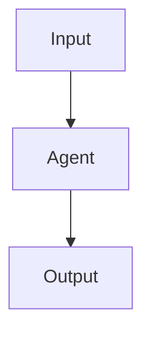

# Pattern Name

## Definition

One or two sentences. What the pattern is, and how it differs from neighboring patterns.

## Structure



## When to use

- Scenario 1
- Scenario 2
- Scenario 3

## When not to use

- Anti-scenario 1
- Anti-scenario 2

## How to implement

1. Define input/output schemas.
2. Define agent roles and tool boundaries.
3. Define state, timeout, retry, cancel.
4. Define trace events.
5. Define degradation strategies on failure.

## Minimal pseudocode

```ts
async function runPattern(input: Input): Promise<Output> {
  // TODO
}
```

## Recommended trace events

- `pattern.started`
- `pattern.completed`
- `pattern.failed`

## Common failure modes

- Failure mode 1
- Failure mode 2

## Implementation checklist

- [ ] Input/output schemas defined
- [ ] Permission boundaries defined
- [ ] Trace events defined
- [ ] Failure strategies defined
- [ ] Cost and timeouts defined

## References

- Link 1

## Optional sections

The base sections above cover most patterns. Patterns that interact with the orchestrator runtime or have an animated counterpart may need additional sections:

### Orchestration semantics (optional)

For patterns where the control flow or scheduling semantics are load-bearing. Use this section to specify:

- Where the plan lives (per-turn, predefined graph, or script-held).
- Whether the pattern is barrier-style (waits for all) or stream-style (per-item).
- How intermediate state is held.
- How recovery works on interruption.

See the [Dynamic Workflow](/patterns/dynamic-workflow-code-orchestration) page for an example.

### Trace events (optional)

For patterns that warrant dedicated event types beyond the generic `pattern.started` / `pattern.completed`. List the events your pattern emits, when they fire, and what fields they carry. Cross-reference [Observability and Event Model](observability) for naming conventions.

### Animation mapping (optional)

If the pattern has an animated counterpart in `data/patterns-extra.ts` or `data/patterns.ts`:

- Note the animation `id` and confirm the mapping in `lib/pattern-map.ts`.
- Document any conceptual mismatch between the topology diagram and the animation (e.g., simplified node count).
- If the animation has variants (parallel barrier, pipeline stream, adversarial review), summarize what each variant illustrates.
