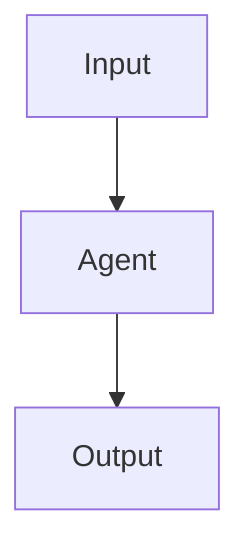

# Pattern Name

## Definition

One or two sentences. What the pattern is, and how it differs from neighboring patterns.

## Structure



## When to use

- Scenario 1
- Scenario 2
- Scenario 3

## When not to use

- Anti-scenario 1
- Anti-scenario 2

## How to implement

1. Define input/output schemas.
2. Define agent roles and tool boundaries.
3. Define state, timeout, retry, cancel.
4. Define trace events.
5. Define degradation strategies on failure.

## Minimal pseudocode

```ts
async function runPattern(input: Input): Promise<Output> {
  // TODO
}
```

## Recommended trace events

- `pattern.started`
- `pattern.completed`
- `pattern.failed`

## Common failure modes

- Failure mode 1
- Failure mode 2

## Implementation checklist

- [ ] Input/output schemas defined
- [ ] Permission boundaries defined
- [ ] Trace events defined
- [ ] Failure strategies defined
- [ ] Cost and timeouts defined

## References

- Link 1
