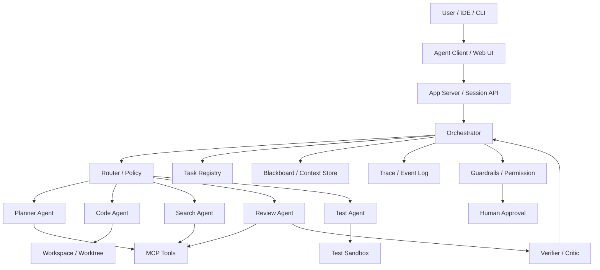

# Production Multi-Agent Runtime

This architecture is suitable for an internal coding-agent platform, an agent CLI, an IDE agent backend, or the orchestration layer behind a Claude Code / Codex-style system.



## Core modules

| Module | Responsibility | Capabilities to ship |
|---|---|---|
| App Server / Session API | Receive requests from user, IDE, CLI | session, stream, cancel, resume |
| Orchestrator | Schedule agents and workflows | plan, route, retry, timeout, checkpoint |
| Agent Registry | Manage agent definitions | name, role, model, tools, permissions, prompt |
| Task Registry | Manage the task tree | task id, parent id, status, owner, artifact |
| Blackboard / Context Store | Hold shared facts and artifacts | facts, artifacts, decisions, TTL, provenance |
| Event Log / Trace | Record every action | message, tool call, handoff, state mutation |
| Guardrails | Permissions and safety | policy, risk scoring, approval, sandbox |
| Workspace Manager | Isolate execution | worktree, container, snapshot, rollback |
| Protocol Gateway | Expose to other systems | MCP, A2A, Agent Client Protocol |

## Recommended data model

```ts
export type AgentDefinition = {
  id: string;
  name: string;
  role: string;
  model: string;
  instructions: string;
  tools: string[];
  permissions: Permission[];
  memoryScope: "none" | "session" | "project" | "global";
};

export type Task = {
  id: string;
  parentId?: string;
  sessionId: string;
  assignedAgent?: string;
  goal: string;
  status: "pending" | "running" | "blocked" | "done" | "failed" | "cancelled";
  input: unknown;
  output?: unknown;
  artifacts?: Artifact[];
  createdAt: string;
  updatedAt: string;
};

export type TraceEvent = {
  id: string;
  runId: string;
  sessionId: string;
  taskId?: string;
  actor: string;
  type: string;
  payload: unknown;
  timestamp: string;
};
```

## Minimal run loop

```ts
async function runSession(session: Session) {
  let state = await loadCheckpoint(session.id);

  while (!state.done) {
    const next = await orchestrator.next(state);

    await eventBus.publish({
      type: "workflow.node.enter",
      actor: "orchestrator",
      payload: next,
    });

    const result = await runNode(next, state);
    state = await checkpoint(reduce(state, result));
  }

  return state.finalAnswer;
}
```

## Key principles

1. **Agents are replaceable execution units, not global state containers.**
2. **Orchestrators own flow; agents own specialty output.**
3. **Blackboard stores facts and artifacts; trace stores process.**
4. **All high-risk actions pass through guardrails.**
5. **Each agent's context should be minimized, isolated, auditable.**
