# Multi-Agent Wiki

A working reference for **multi-agent interaction patterns, classification, and engineering implementation**. Not a paper survey, not a framework brochure — an engineering knowledge base where every pattern answers four questions:

1. What problem does it solve?
2. What is its communication / control structure?
3. How do you implement it in a real system?
4. When should you *not* use it?

## Recommended reading paths

- New here → start with the [Taxonomy](taxonomy)
- Picking a design → jump to the [Decision Matrix](decision-matrix)
- Building a platform → read [Production Runtime Architecture](implementation/production-runtime)
- Adding a new pattern → use the [Pattern Page Template](implementation/pattern-page-template)
- Looking up a term → consult the [Glossary](reference/glossary)

## One-line definition

A **multi-agent system** is composed of multiple agents — each with its own responsibility, state, tools or context — that collaborate, compete, review, delegate, and decompose tasks through messages, tool calls, shared state, event streams, protocols, or environment changes.

## Global taxonomy

```mermaid
flowchart TD
  A[Multi-Agent Wiki] --> B[Control structure]
  A --> C[Information flow]
  A --> D[Decision making]
  A --> E[Execution environment]
  A --> F[Protocol interconnect]

  B --> B1[Supervisor / Manager]
  B --> B2[Agents-as-tools]
  B --> B3[Handoff / Router]
  B --> B4[Hierarchical]
  B --> B5[Peer-to-peer / Swarm]

  C --> C1[Sequential Pipeline]
  C --> C2[Parallel Fan-out / Gather]
  C --> C3[Group Chat]
  C --> C4[Nested Chat]
  C --> C5[Blackboard / Shared Memory]
  C --> C6[Event Bus / Pub-Sub]

  D --> D1[Debate / Judge]
  D --> D2[Voting / Ensemble]
  D --> D3[Generator-Critic]
  D --> D4[Refinement Loop]
  D --> D5[Market / Auction]
  D --> D6[Clarification-at-edge]

  E --> E1[Role-playing / SOP]
  E --> E2[Human-in-the-loop]
  E --> E3[Workspace / Sandbox]
  E --> E4[Stigmergy]
  E --> E5[Simulation / MARL]

  F --> F1[MCP: Agent-Tool]
  F --> F2[A2A: Agent-Agent]
  F --> F3[ACP / ANP]
  F --> F4[Agent Client Protocol]
```

## Why classify?

Multi-agent isn't just "many LLMs talking." In production the questions that actually matter are:

- Who holds control at any given moment?
- How is context isolated between agents?
- How are conflicting outputs merged?
- How do tasks recover, cancel, retry, and trace?
- Which actions need human approval?
- Which capabilities are exposed over MCP / A2A / Agent Client Protocol?

In public materials, the OpenAI Agents SDK frames agents as units that plan, call tools, collaborate across specialists, and maintain state; LangChain decomposes multi-agent into subagents, handoffs, skills, and routers; Google ADK treats pipeline, parallel, hierarchical, generator-critic, refinement loop, and human-in-the-loop as composable production patterns. See [References](reference/references).
