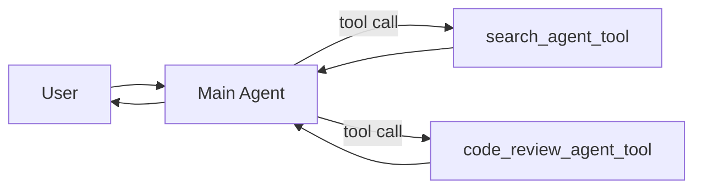

# Agents-as-tools

## Definition

Wrap a specialist agent as a callable tool. The host agent never gives up control — it just calls the specialist like any other function.

**Category**: Control structure

## Structure



## When to use

Single-shot specialist queries, retrieval sub-tasks, code review, document summarization, internal capabilities exposed as tools.

## When not to use

When the specialist needs sustained multi-turn dialogue with the user, or when agents must take over from one another.

## How to implement

1. Wrap each sub-agent as a normal tool, e.g. `callSearchAgent(input)`.
2. The tool schema must pin down inputs and outputs — don't leave a natural-language interface.
3. The host agent's system prompt declares when to call each agent-tool.
4. Sub-agents never face the user; they return results, evidence, and limits.
5. Each agent-tool gets its own trace so failures are easy to attribute.

## Minimal pseudocode

```ts
const searchAgentTool = tool({
  name: "search_agent",
  description: "Investigate public sources and return a list of evidence",
  schema: z.object({ query: z.string(), depth: z.enum(["fast", "deep"]) }),
  execute: async ({ query, depth }) => searchAgent.run({ query, depth })
});

const mainAgent = new Agent({
  tools: [searchAgentTool, reviewAgentTool],
  instructions: "Call search_agent for research; call review_agent for quality checks."
});
```

## Recommended trace events

- `tool.agent.invoked`
- `tool.agent.output`
- `tool.agent.error`

## Common failure modes

- The sub-agent tool description is too broad; the host calls it indiscriminately.
- The sub-agent returns long prose instead of structured results.
- The host treats the sub-agent as authoritative without verification.

## Implementation checklist

- [ ] Input/output schemas defined.
- [ ] Each agent's permission boundary defined.
- [ ] Every agent call carries a run id / trace id.
- [ ] Failure, timeout, cancel, and retry strategies defined.
- [ ] Context passed is the minimum required, not the full history.
- [ ] High-risk actions are gated by approval or a verifier.

## References

- [OpenAI tools](https://openai.github.io/openai-agents-python/tools/)
- [LangChain multi-agent](https://docs.langchain.com/oss/python/langchain/multi-agent)
