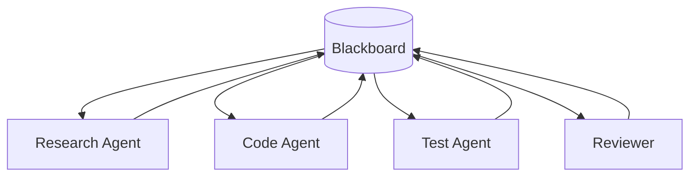

# Blackboard / Shared Memory / Workspace

## Definition

Multiple agents collaborate indirectly through shared state, knowledge base, task board, or workspace.

**Category**: Information flow

## Structure



## When to use

Long-running tasks, asynchronous collaboration, multi-party shared evidence, code workspaces, task-state management.

## When not to use

When the shared state has no versioning, no permissions, and no expiry — it will rot.

## How to implement

1. Partition the blackboard: `facts / hypotheses / tasks / artifacts / decisions`.
2. Every record carries source, timestamp, confidence, owner, TTL.
3. Agents read/write only through APIs — no direct global state mutation.
4. Surface conflicting facts as a conflict set; do not silently overwrite.

## Minimal pseudocode

```ts
type BlackboardItem = {
  id: string;
  type: "fact" | "hypothesis" | "artifact" | "decision" | "task";
  content: unknown;
  sourceAgent: string;
  confidence?: number;
  createdAt: string;
  ttl?: number;
};
```

## Recommended trace events

- `blackboard.item.created`
- `blackboard.item.updated`
- `blackboard.conflict.detected`
- `blackboard.item.expired`

## Common failure modes

- State pollution.
- Stale entries treated as fresh.
- Concurrent writes from multiple agents.
- No provenance.

## Implementation checklist

- [ ] Input/output schemas defined.
- [ ] Each agent's permission boundary defined.
- [ ] Every agent call carries a run id / trace id.
- [ ] Failure, timeout, cancel, and retry strategies defined.
- [ ] Context passed is the minimum required, not the full history.
- [ ] High-risk actions are gated by approval or a verifier.

## References

- [Survey of communication](https://arxiv.org/html/2502.14321v2)
- [Google ADK patterns](https://developers.googleblog.com/developers-guide-to-multi-agent-patterns-in-adk/)
