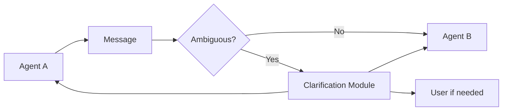

# Clarification-at-edge / Ask-before-act

## Definition

Insert a clarification step at agent-agent handoff edges, or before uncertain actions, to reduce error propagation.

**Category**: Decision

## When to use

Vague requirements, agent handoffs, long tasks, multi-constraint tasks, ambiguous user intent.

## When not to use

When asking at every step is intolerable, or when the clarification cannot change the execution outcome.

## Structure



## How to implement

1. Score every cross-agent message for ambiguity / risk.
2. Above threshold, ask the source agent or user — don't guess.
3. Clarification questions should be few, specific, and actionable.
4. Record whether clarification actually reduced failure, and tune the threshold.

## Minimal pseudocode

```ts
const score = ambiguityScorer.score(edgeMessage);
if (score > threshold) {
  const clarification = await askClarification(edgeMessage);
  edgeMessage = merge(edgeMessage, clarification);
}
return targetAgent.run(edgeMessage);
```

## Recommended trace events

- `clarification.triggered`
- `clarification.question.asked`
- `clarification.answer.received`
- `clarification.skipped`

## Common failure modes

- Over-interrupting the user.
- Questions too abstract to answer.
- Clarification results don't make it back into state.

## Implementation checklist

- [ ] Input/output schemas defined.
- [ ] Each agent's permission boundary defined.
- [ ] Every agent call carries a run id / trace id.
- [ ] Failure, timeout, cancel, and retry strategies defined.
- [ ] Context passed is the minimum required, not the full history.
- [ ] High-risk actions are gated by approval or a verifier.

## References

- [AgentAsk](https://arxiv.org/html/2510.07593v1)
