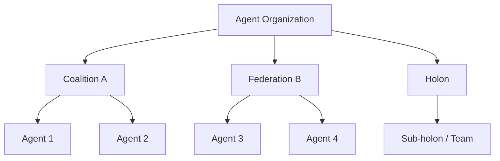

# Coalition / Federation / Holonic Organization

## Definition

Multiple agents temporarily form a coalition, team, federation, or holon around a task. The focus is governance, membership, and autonomy boundaries — not a single invocation flow.

**Category**: Organization

## Structure



## When to use

Cross-team collaboration, open agent networks, multi-organization tasks, interconnected internal agent platforms.

## When not to use

Small, fixed flows; no dynamic team formation; simple permission boundaries.

## How to implement

1. Define an organization registry: org, members, capabilities, trust levels.
2. Define rules for joining, leaving, authorization, and revocation.
3. For coalition tasks, establish a shared contract: goal, resources, payoff, accountability.
4. Federated systems must cleanly separate local autonomy and global coordination.

## Minimal pseudocode

```ts
type Organization = {
  id: string;
  type: "coalition" | "federation" | "holon" | "team";
  members: AgentId[];
  policy: AccessPolicy;
  sharedGoal?: string;
};

function formCoalition(task, candidates) {
  return candidates.filter(a => matches(task.requiredSkills, a.skills));
}
```

## Recommended trace events

- `organization.created`
- `organization.member.joined`
- `organization.member.left`
- `organization.policy.updated`

## Common failure modes

- Member permissions are unclear.
- Coalition goals conflict with individual goals.
- Organizational state never gets cleaned up.

## Implementation checklist

- [ ] Trigger and exit conditions defined.
- [ ] Input/output schemas defined.
- [ ] Permission, budget, timeout, and retry policies defined.
- [ ] Trace events defined.
- [ ] Degradation or human-takeover strategies defined.

## References

- [Organisational paradigms in multi-agent systems](https://dl.acm.org/doi/abs/10.1017/s0269888905000317)
