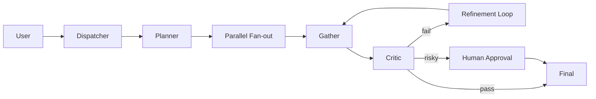

# Composite Pattern

## Definition

Real production systems are rarely a single pattern. They compose pipeline, parallel, handoff, critic, HITL, blackboard, and protocol layers into one business flow.

**Category**: Composition

## Structure



## When to use

Enterprise agent platforms, coding agents, support agents, research agents — anywhere stable delivery matters.

## When not to use

Before single patterns are validated. Composite complexity compounds fast.

## How to implement

1. Settle on a main flow first: workflow / graph.
2. Insert patterns at specific nodes: parallel retrieval, handoff, critic, approval.
3. All patterns share one state model, event model, and task registry.
4. Define input/output schemas at every composition boundary.
5. Ship the P0 path first; add advanced patterns iteratively.

## Minimal pseudocode

```ts
const workflow = graph()
  .node("plan", planner)
  .node("parallel_research", fanout([searchA, searchB]))
  .node("draft", writer)
  .node("review", critic)
  .edge("review", s => s.review.pass ? "final" : "draft");

return workflow.run(userTask);
```

## Recommended trace events

- `composite.workflow.started`
- `composite.pattern.enter`
- `composite.pattern.exit`
- `composite.workflow.completed`

## Common failure modes

- After composition you cannot tell which pattern caused the problem.
- Inconsistent state models.
- Each pattern has its own trace; nothing ties them together.

## Implementation checklist

- [ ] Trigger and exit conditions defined.
- [ ] Input/output schemas defined.
- [ ] Permission, budget, timeout, and retry policies defined.
- [ ] Trace events defined.
- [ ] Degradation or human-takeover strategies defined.

## References

- [Google ADK patterns](https://developers.googleblog.com/developers-guide-to-multi-agent-patterns-in-adk/)
- [Microsoft Agent Framework](https://learn.microsoft.com/en-us/agent-framework/overview/)
