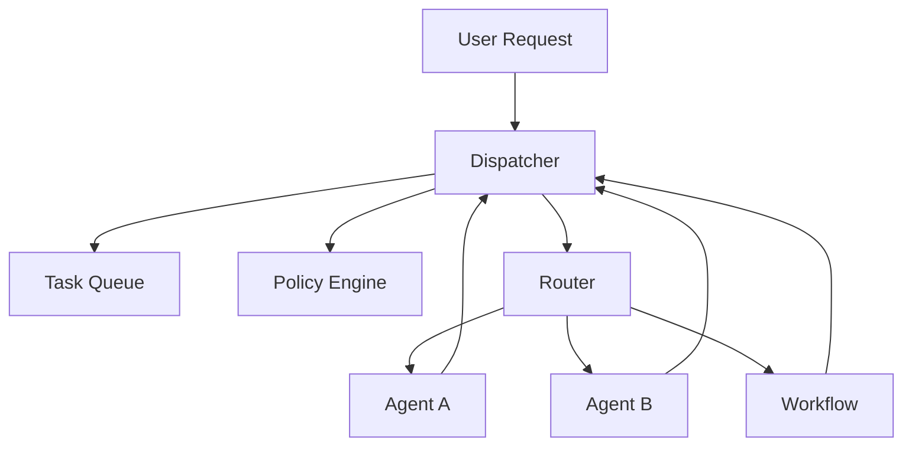

# Coordinator / Dispatcher

## Definition

The Dispatcher distributes requests to agents, workflows, or tools, and maintains task state, retry, timeout, and routing policy. It is more engineering-focused than a Router and more of a system component than a Supervisor.

**Category**: Control structure

## Structure



## When to use

Internal platforms, long-running tasks, multi-tenant agent services, systems that need resumable scheduling and unified policy.

## When not to use

One-off demos, single-agent chat, or lightweight tasks with no state-recovery requirement.

## How to implement

1. Design the Dispatcher as a service layer — not as an LLM agent.
2. On every request, create a task / run / session and write a checkpoint.
3. Choose sync execution, async queue, workflow, or handoff based on policy.
4. Reduce agent results to a uniform status: `success / blocked / need_input / failed`.
5. Centralize retry, cancel, timeout, and budget at the Dispatcher.

## Minimal pseudocode

```ts
type DispatchDecision = {
  mode: "agent" | "workflow" | "tool" | "ask_user";
  target: string;
  async: boolean;
  reason: string;
};

async function dispatch(req: UserRequest) {
  const run = await runs.create(req);
  const decision = await router.decide(req, policy.allowedTargets(req));
  return scheduler.schedule(run, decision);
}
```

## Recommended trace events

- `dispatch.request.created`
- `dispatch.decision.made`
- `dispatch.scheduled`
- `dispatch.completed`

## Common failure modes

- Dispatcher starts writing complex prompts — it becomes an opaque agent.
- No task/run/session layering.
- Retry policy scattered inside each agent.

## Implementation checklist

- [ ] Trigger and exit conditions defined.
- [ ] Input/output schemas defined.
- [ ] Permission, budget, timeout, and retry policies defined.
- [ ] Trace events defined.
- [ ] Degradation or human-takeover strategies defined.

## References

- [Google ADK patterns](https://developers.googleblog.com/developers-guide-to-multi-agent-patterns-in-adk/)
