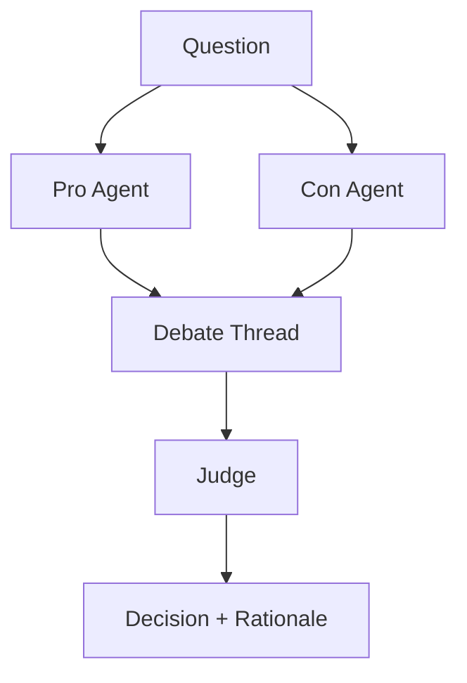

# Debate / Judge / Voting

## Definition

Several agents propose different positions or answers and challenge one another; a judge or voting mechanism picks the final result.

**Category**: Decision

## Structure



## When to use

Option selection, red-team / blue-team, fact checking, complex reasoning, choosing among multiple candidate answers.

## When not to use

When the answer can be verified by a tool, when cost is critical, or when the judge itself is unreliable.

## How to implement

1. Let agents generate initial positions independently to reduce cross-contamination.
2. Cap the number of debate rounds to avoid runaway arguments.
3. The judge must cite evidence and rubric — not just preference.
4. For verifiable tasks, prefer tool verification over an LLM judge.

## Minimal pseudocode

```ts
const proposals = await Promise.all(agents.map(a => a.propose(question)));
const debate = await runDebate(proposals, { rounds: 2 });
const verdict = await judge.evaluate({ question, proposals, debate, rubric });
return verdict;
```

## Recommended trace events

- `debate.proposal.created`
- `debate.round.completed`
- `judge.verdict.created`
- `vote.tallied`

## Common failure modes

- Persuasive but factually wrong arguments win.
- The judge favors the more eloquent agent.
- Cost exceeds the value of the decision.

## Implementation checklist

- [ ] Input/output schemas defined.
- [ ] Each agent's permission boundary defined.
- [ ] Every agent call carries a run id / trace id.
- [ ] Failure, timeout, cancel, and retry strategies defined.
- [ ] Context passed is the minimum required, not the full history.
- [ ] High-risk actions are gated by approval or a verifier.

## References

- [Survey: LLM-based multi-agent](https://arxiv.org/html/2412.17481v2)
