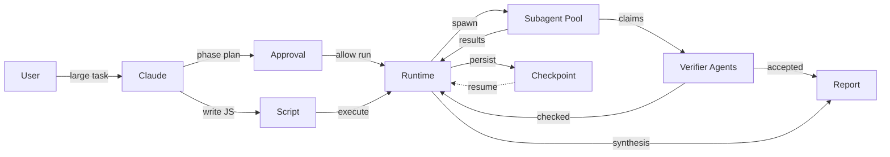

## Problem It Solves

When a task exceeds the stable range of a single conversational pass or a small number of subagents, orchestration logic needs to be fixed in code rather than left to per-turn judgment.

A conversational agent that coordinates everything through its primary context window faces three compounding problems:

- **Context dilution**: intermediate results from dozens of files or sources fill the context, crowding out the synthesized understanding.
- **Plan drift**: without a persistent representation of the plan, each turn re-derives coordination from scratch.
- **No recovery boundary**: if the session is interrupted, no intermediate state survives.

Dynamic Workflow moves the plan into an executable script. The script holds loops, branches, fan-out, intermediate variables, cross-checking logic, and convergence conditions. Subagents perform the actual reading, editing, shell, web, and MCP work.

## Topology



## Control Semantics

The workflow script owns the control flow. The main agent does not coordinate subagents turn by turn. Instead:

1. Claude writes a script that encodes the full plan: phases, iteration conditions, fan-out shape, and stop conditions.
2. The runtime executes the script in the background.
3. The script calls into a subagent pool to do actual work.
4. The script decides when to verify, when to checkpoint, when to converge.

This is the key difference from prompt-orchestrated subagents: **the plan is a first-class artifact**, not an implicit consequence of the agent's reasoning in each turn.

## State Semantics

Intermediate results live in script variables and runtime state, not in the main conversation context. Only the final synthesized report is returned to the user-facing session.

This means:
- 50 file audit results do not need to fit in one context window simultaneously.
- Partial results can be checkpointed and reused if the script reruns a phase.
- The main session stays responsive while the workflow runs in the background.

## Execution Semantics

The workflow script coordinates. Subagents do the actual work:

| Layer | Responsibility |
|---|---|
| Workflow script | loop control, fan-out shape, phase transitions, stop conditions |
| Runtime | spawn agents, collect results, manage checkpoints |
| Subagents | read files, write edits, run shell, call web, invoke MCP |

The script itself has no direct filesystem or shell access. Every side-effecting operation goes through a subagent.

## Quality Semantics

Cross-checking is a first-class orchestration concern:

- Worker agents produce findings from independent slices of the task.
- Verifier agents try to disprove each finding before it reaches synthesis.
- Weak or unsupported claims are filtered at the orchestration layer, not left to the final synthesis agent.
- The script can rerun disputed areas or request narrower evidence.

## When to Use

- **Codebase-wide audits**: security scan, dependency check, API surface review across hundreds of files.
- **Large migrations**: file-by-file behavior-equivalent porting with per-file review agents and a build/test fix loop.
- **Cross-checked research**: gather claims from multiple sources, verify each claim independently, synthesize only what survives.
- **Plan stress tests**: generate multiple candidate plans, run adversarial review on each, converge on the most defensible option.
- **Repeated engineering workflows**: workflows you want to save to `.claude/workflows/` and rerun with different parameters.

## When Not to Use

- **Small tasks**: for anything a single agent can handle in one pass, the overhead of a workflow script adds cost and complexity without benefit.
- **High-interactivity tasks**: workflows do not accept mid-run user input. If each step requires human sign-off, split into multiple smaller workflows with gates between them.
- **Unbudgeted token usage**: workflows multiply token consumption significantly. Start with a scoped task before running a codebase-wide workflow.
- **Ungoverned permissions**: if you haven't reviewed the tool allowlist and shell access policy, don't run a workflow that can spawn dozens of agents with write access.

## Implementation Sketch

> **Note**: The following is conceptual pseudo-code. It is not a public Claude API contract. Primitive names and signatures may differ from any runtime implementation.

```ts
// Conceptual pseudo-code, not a public Claude API contract.
export default async function workflow(ctx) {
  // Phase 1: discover the task surface
  const files = await ctx.agent("map-codebase", ctx.goal)

  // Phase 2: fan out worker agents across files
  const findings = await ctx.parallel(
    files.map(file => ctx.agent("audit-file", { file }))
  )

  // Phase 3: adversarial cross-check
  const checked = await ctx.parallel(
    findings.map(f => ctx.agent("adversarial-review", f))
  )

  // Only verified findings reach synthesis
  return ctx.synthesize(checked.filter(x => x.verified))
}
```

Key primitives (conceptual):

- `ctx.agent(task, input)` — spawns a worker subagent session, returns structured result.
- `ctx.parallel(promises)` — barrier semantics: waits for all workers before proceeding.
- `ctx.pipeline(items, stages)` — stream semantics: items flow through stages independently.
- `ctx.checkpoint(state)` — persists intermediate results for recovery.
- `ctx.synthesize(results)` — produces the final convergence for the main session.

## Trace Events

Observability requires events at both the workflow and agent layers:

| Event | Description |
|---|---|
| `workflow.created` | Script written by Claude, before approval |
| `workflow.approved` | User confirmed phases, cost estimate, and script |
| `workflow.phase.started` | A named phase of the script began |
| `agent.spawned` | A subagent was dispatched from the script |
| `agent.completed` | A subagent returned a result |
| `claim.verified` | A verifier agent accepted or rejected a finding |
| `workflow.checkpoint.saved` | Intermediate state persisted to disk |
| `workflow.finalized` | Final synthesis returned to the main session |

## Risks

| Risk | Mitigation |
|---|---|
| Token cost multiplies quickly | Start scoped, set token budget and stop condition, prefer smaller models for low-risk stages |
| Correlated failures from poor decomposition | Design phases so each phase has an independent failure mode |
| Permissions exceed expectations | Review tool allowlist before run; subagents inherit the session's allowlist |
| Shell/web/MCP mid-run prompts block the workflow | Pre-approve expected tool categories before starting |
| Recovery only within same session | Use checkpoint for long runs; design phases so rerun is safe |
| Concurrent agent cap | Structure fan-out to stay within platform concurrency limits |
| File write conflicts from parallel agents | Use worktree isolation or explicit file-level locking in the script |

## Related Patterns

- **[Graph Workflow](/patterns/graph-workflow)** — predefined state machine; the graph is fixed at design time, not generated by the model.
- **[Parallel Fan-out / Gather](/patterns/parallel-fanout-gather)** — one level of fan-out without a script holding the plan.
- **[Generator-Critic](/patterns/generator-critic)** — critic embedded in a conversational loop; workflow generalizes this to script-controlled adversarial review.
- **[Refinement Loop](/patterns/refinement-loop)** — iterative improvement in the main context; workflow moves the loop into the script.
- **[Workspace Isolation](/patterns/workspace-isolation)** — worktrees provide the file-level isolation that makes parallel write agents safe.
- **[Event Bus / Pub-Sub](/patterns/event-bus-pubsub)** — workflow trace events can be routed through an event bus for observability.
