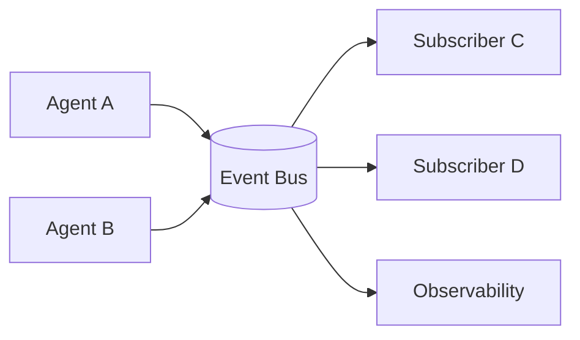

# Event Bus / Pub-Sub

## Definition

Agents communicate through events, topics, and queues asynchronously, rather than via direct function calls.

**Category**: Information flow

## Structure



## When to use

Platform-scale async tasks, long-running work, observability, cross-service agent orchestration.

## When not to use

Simple synchronous tasks, or organizations without event-schema governance.

## How to implement

1. Design a unified event envelope: `event_id, run_id, session_id, type, payload, timestamp`.
2. Define a schema and version per event type.
3. Every agent action publishes events; orchestrators recover state from the log.
4. Support replay, dedupe, idempotency, dead-letter queues.

## Minimal pseudocode

```ts
type AgentEvent = {
  id: string;
  runId: string;
  sessionId: string;
  type: string;
  actor: string;
  payload: unknown;
  ts: string;
  schemaVersion: string;
};
```

## Recommended trace events

- `event.published`
- `event.consumed`
- `event.replayed`
- `event.dead_lettered`

## Common failure modes

- Events without a schema.
- Duplicate consumption causes duplicate side effects.
- Async pipelines are hard to debug.
- Event volume too high without sampling.

## Implementation checklist

- [ ] Input/output schemas defined.
- [ ] Each agent's permission boundary defined.
- [ ] Every agent call carries a run id / trace id.
- [ ] Failure, timeout, cancel, and retry strategies defined.
- [ ] Context passed is the minimum required, not the full history.
- [ ] High-risk actions are gated by approval or a verifier.

## References

- [Microsoft Agent Framework](https://learn.microsoft.com/en-us/agent-framework/overview/)
- [Survey of communication](https://arxiv.org/html/2502.14321v2)
