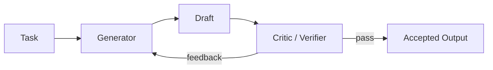

# Generator-Critic / Verifier

## Definition

One agent generates; another critiques, verifies, scores, or proposes revisions.

**Category**: Decision

## Structure



## When to use

Code generation + review, document drafting + editing, plan generation + verification, test repair loops.

## When not to use

When the critic has no additional information or tools — it will just echo the generator's biases.

## How to implement

1. The critic's prompt and tools must differ from the generator's.
2. The critic's output is structured: issue, severity, evidence, suggested fix.
3. For code tasks, the critic should run tests, linters, and diff checks where possible.
4. The generator revises against feedback for up to N iterations.

## Minimal pseudocode

```ts
let draft = await generator.run(task);
for (let i = 0; i < maxIterations; i++) {
  const review = await critic.review({ task, draft });
  if (review.passed) return draft;
  draft = await generator.revise({ task, draft, review });
}
return { draft, warning: "max iterations reached" };
```

## Recommended trace events

- `generator.draft.created`
- `critic.review.completed`
- `critic.issue.found`
- `draft.revised`

## Common failure modes

- The critic only does style commentary, no fact verification.
- The loop iterates without improvement.
- Critic and generator share the same context, producing correlated errors.

## Implementation checklist

- [ ] Input/output schemas defined.
- [ ] Each agent's permission boundary defined.
- [ ] Every agent call carries a run id / trace id.
- [ ] Failure, timeout, cancel, and retry strategies defined.
- [ ] Context passed is the minimum required, not the full history.
- [ ] High-risk actions are gated by approval or a verifier.

## References

- [Google ADK patterns](https://developers.googleblog.com/developers-guide-to-multi-agent-patterns-in-adk/)
- [Google architecture patterns](https://docs.cloud.google.com/architecture/choose-design-pattern-agentic-ai-system)
