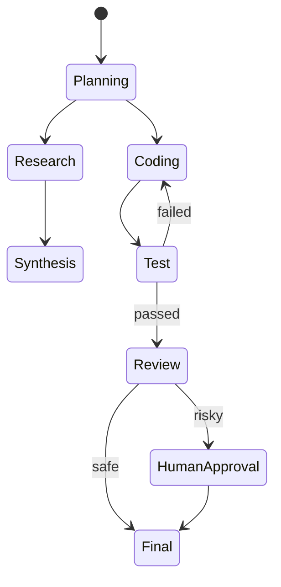

# Graph / State Machine / Workflow

## Definition

Model the agent flow as an explicit graph, state machine, or workflow — rather than letting the LLM decide every transition.

**Category**: Control structure

## Structure



## When to use

Production systems, resumable tasks, long-running work, agent platforms that need audit trails and permission boundaries.

## When not to use

Lightweight demos, pure chat, or exploratory tasks where the flow is entirely unknown.

## How to implement

1. Model the flow as `nodes + edges + state`.
2. The LLM can choose an edge but cannot bypass state-machine constraints.
3. Every node should be replayable, resumable, and cancellable.
4. Graph state stores messages, tool calls, task status, and permission state.

## Minimal pseudocode

```ts
type Node = "plan" | "research" | "code" | "test" | "review" | "final";
type Edge = (state: State) => Node;

while (state.node !== "final") {
  const output = await runNode(state.node, state);
  state = checkpoint({ ...state, ...output });
  state.node = route(state);
}
```

## Recommended trace events

- `workflow.node.enter`
- `workflow.node.exit`
- `workflow.edge.selected`
- `workflow.checkpoint.created`

## Common failure modes

- The graph is too rigid and the agent loses flexibility.
- State fields are scattered, making resume hard.
- LLM routing conflicts with business rules.

## Implementation checklist

- [ ] Input/output schemas defined.
- [ ] Each agent's permission boundary defined.
- [ ] Every agent call carries a run id / trace id.
- [ ] Failure, timeout, cancel, and retry strategies defined.
- [ ] Context passed is the minimum required, not the full history.
- [ ] High-risk actions are gated by approval or a verifier.

## References

- [Microsoft Agent Framework](https://learn.microsoft.com/en-us/agent-framework/overview/)
- [Google architecture patterns](https://docs.cloud.google.com/architecture/choose-design-pattern-agentic-ai-system)
- [LangChain multi-agent](https://docs.langchain.com/oss/python/langchain/multi-agent)
