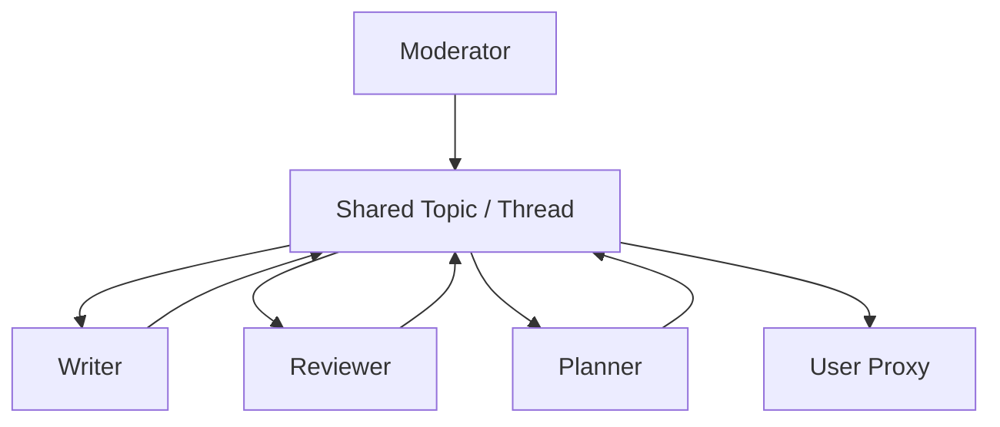

# Group Chat / Meeting

## Definition

Multiple agents share a single message thread or topic. A rule, an LLM selector, or a human moderator decides who speaks next.

**Category**: Information flow

## Structure



## When to use

Brainstorming, architecture review, multi-perspective discussion, simulated product / design / engineering meetings.

## When not to use

When you need a deterministic flow, low cost, strong audit trails, or strict permission boundaries.

## How to implement

1. Define participants, roles, speaker selection rules, and termination conditions.
2. Use a moderator to pick the next speaker — round-robin, rule-based, or LLM selector.
3. Keep only necessary information in the shared thread; trim off-topic messages.
4. Periodically summarize the thread to keep tokens manageable.

## Minimal pseudocode

```ts
while (!termination(thread)) {
  const speaker = await moderator.selectSpeaker(thread, agents);
  const msg = await speaker.reply(thread);
  thread.append({ speaker: speaker.name, content: msg });
}
return summarizer.run(thread);
```

## Recommended trace events

- `groupchat.speaker.selected`
- `groupchat.message.appended`
- `groupchat.terminated`
- `groupchat.summary.created`

## Common failure modes

- Conversation drifts.
- Token cost grows rapidly.
- Weak agents get carried along by louder ones.
- No concrete artifact produced.

## Implementation checklist

- [ ] Input/output schemas defined.
- [ ] Each agent's permission boundary defined.
- [ ] Every agent call carries a run id / trace id.
- [ ] Failure, timeout, cancel, and retry strategies defined.
- [ ] Context passed is the minimum required, not the full history.
- [ ] High-risk actions are gated by approval or a verifier.

## References

- [AutoGen patterns](https://microsoft.github.io/autogen/0.2/docs/tutorial/conversation-patterns/)
- [AutoGen group chat](https://microsoft.github.io/autogen/stable/user-guide/core-user-guide/design-patterns/group-chat.html)
