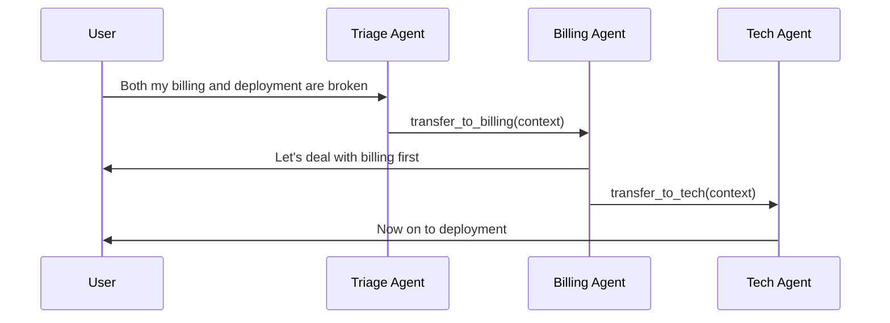

# Handoff / Router / Transfer

## Definition

The active agent transfers conversation control to another agent, who then owns the rest of the interaction.

**Category**: Control structure

## Structure



## When to use

Support / after-sales triage, domain expert switching, multi-turn workflows where a specialist needs to question the user directly.

## When not to use

When the subtask is just a one-off query, or when handoff criteria are vague and the conversation keeps bouncing.

## How to implement

1. Each agent declares which `handoff_intents` it accepts.
2. A handoff is not a function call — it changes which agent is active.
3. Pass a trimmed context across: user goal, completed items, open items, permission boundary.
4. Set a maximum handoff count and detect loops.
5. Log each handoff with `from / to / reason / context_digest`.

## Minimal pseudocode

```ts
async function maybeHandoff(state: SessionState) {
  const decision = await router.classify(state.lastMessage, state.activeAgent);
  if (decision.type === "handoff") {
    assert(!state.handoffHistory.includesLoop(decision.to));
    return {
      ...state,
      activeAgent: decision.to,
      handoffHistory: [...state.handoffHistory, decision]
    };
  }
  return state;
}
```

## Recommended trace events

- `handoff.requested`
- `handoff.accepted`
- `handoff.rejected`
- `handoff.loop_detected`

## Common failure modes

- Handoff reasons aren't recorded → debugging is impossible.
- Full context is transferred, polluting the receiving agent.
- Loops between agents.
- The user has no idea which agent is in front of them.

## Implementation checklist

- [ ] Input/output schemas defined.
- [ ] Each agent's permission boundary defined.
- [ ] Every agent call carries a run id / trace id.
- [ ] Failure, timeout, cancel, and retry strategies defined.
- [ ] Context passed is the minimum required, not the full history.
- [ ] High-risk actions are gated by approval or a verifier.

## References

- [OpenAI handoffs](https://openai.github.io/openai-agents-python/handoffs/)
- [LangChain handoffs](https://docs.langchain.com/oss/python/langchain/multi-agent/handoffs)
